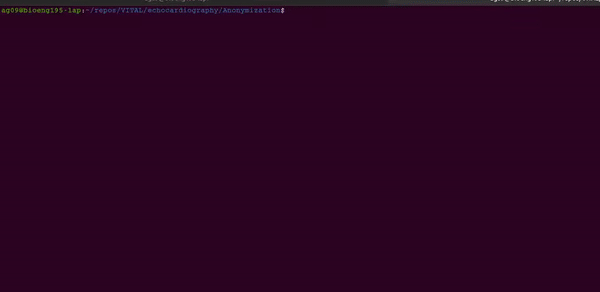

# Anonymisation for Sonosite videos

Author: Alberto Gomez 2019

This uses opencv. Edit the code to enter the original video nam,e and the output name. If you know the crop box, you can also pass it as arugment, otherwise a window will show for you to select the region to be preserved.

TODO: pass input parameters by argument.

