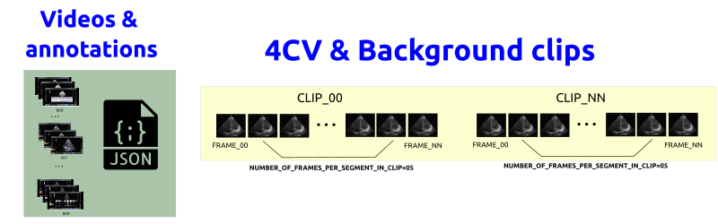
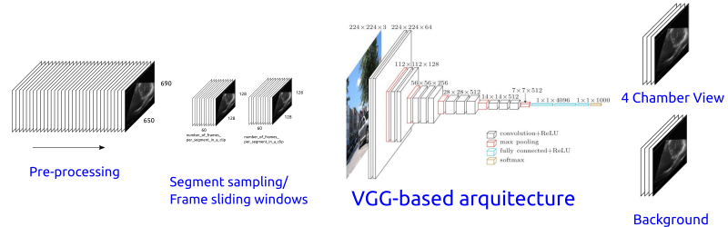
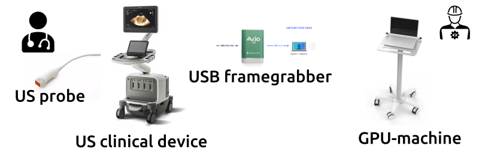

# Real-time AI-empowered echocardiography

## Summary 
This repository contains code, details of data and documentation for a clinical system to perform real-time artificial-intelligence-empowered echocardiography.
The machine learning pipeline follow [the total product lifecycle (TPLC) approach on AI/ML workflow from Good Machine Learning Practices](scripts/learning-pipeline).

## Data collection, validation and management 
1. Video data from GE Venue Go GE using Probe 3SC-RS was collected with a Portable Video Recorder. See [more](data).
2. Creation and verification of annotations with VGG Image Annotator (VIA) software.
3. :notebook: for [data curation, selection and validation](scripts/curation-selection-validation); 
     
_**Fig 1.** Data workflow._

## Deep learning pipeline
1. Model training and tuning; 
2. Model validation (performance evaluation and clinical evaluation); 
3. AI-based device modification, and (perhaps) AI-based production model (Figure 1). 
     
_**Fig 2.** Deep learning pipeline of the AI-empowered echocardiography._

## Clinical system  
Figure 2 illustrate the real-time AI-empowered clinical system based on [EPIQ 7 ultrasound](https://www.philips.co.uk/a-w/about/news/archive/standard/news/backgrounders/Inside-Innovation-EPIQ.html), [X5-1 xMATRIX array transducer ](https://www.philips.co.uk/healthcare/product/HC989605400801/x5-1) and [framegrabber avio-hd](https://www.epiphan.com/products/avio-hd/).
For further details on the system, see [here](docs/system).   
    
_**Fig 3.** Real-time AI-empowered clinical system._  

## Contents

In addition to the python code, this repo contains:

* [PRETUS_Plugins](PRETUS_Plugins) with plugins for [pretus](https://github.com/gomezalberto/pretus).

## Contents

In addition to the python code, this repo contains:

* [PRETUS_Plugins](PRETUS_Plugins) with plugins for [pretus](https://github.com/gomezalberto/pretus).

## Clone repository
After generating your SSH keys as suggested [here](https://docs.github.com/en/authentication/connecting-to-github-with-ssh/generating-a-new-ssh-key-and-adding-it-to-the-ssh-agent), you can then clone the repository by typing (or copying) the following lines in a terminal:
```
mkdir -p $HOME/repositories/ && cd $HOME/repositories/ ## suggested path
git clone git@github.com:vital-ultrasound/echocardiography.git
```

## Contributors
Thanks goes to all these people ([emoji key](https://allcontributors.org/docs/en/emoji-key)):  
<!-- ALL-CONTRIBUTORS-LIST:START - Do not remove or modify this section -->
<!-- prettier-ignore-start -->
<!-- markdownlint-disable -->

<table>
  <tr>
    <td align="center"><a href="https://github.com/mxochicale"><br /><sub><b>Miguel Xochicale</b></sub>           </a><br /><a href="https://github.com/vital-ultrasound/echocardiography/commits?author=fepegar" title="Code">💻</a> <a href="https://github.com/fepegar/torchio/commits?author=mxochicale" title="Documentation">📖</a></td>
    <td align="center"><a href="https://github.com/hamidehkerdegari"><br /><sub><b>Hamideh Kerdegari </b></sub>   </a><br /><a href="https://github.com/vital-ultrasound/echocardiography/commits?author=hamidehkerdegari" title="Code">💻</a> </td>
    <td align="center"><a href="https://github.com/huynhatd13"><br /><sub><b>Nhat Phung Tran Huy</b></sub>        </a><br /><a href="https://github.com/vital-ultrasound/echocardiography/commits?author=huynhatd13" title="Code">💻</a></td>
    <td align="center"><a href="https://github.com/"><br /><sub><b>Linda Denehy</b></sub>        </a><br /><a href="https://github.com/vital-ultrasound/echocardiography/commits?author=" title="Research">  🔬 🤔  </a></td>
    <td align="center"><a href="https://github.com/"><br /><sub><b>Louise Thwaites</b></sub>        </a><br /><a href="https://github.com/vital-ultrasound/echocardiography/commits?author=" title="Research">  🔬 🤔  </a></td>
    <td align="center"><a href="https://github.com/"><br /><sub><b>Sophie Yacoub</b></sub>        </a><br /><a href="https://github.com/vital-ultrasound/echocardiography/commits?author=" title="Research">  🔬 🤔  </a></td>
    <td align="center"><a href="https://github.com/atoandy"><br /><sub><b>Andrew King</b></sub>        </a><br /><a href="https://github.com/vital-ultrasound/nnUNet-for-PRETUS/commits?author=atoandy" title="Research">  🔬🤔  </a></td>
    <td align="center"><a href="https://github.com/gomezalberto"><br /><sub><b>Alberto Gomez</b></sub>             </a><br /><a href="https://github.com/vital-ultrasound/echocardiography/commits?author=gomezalberto" title="Code">💻</a></td>
  </tr>
</table>
<!-- markdownlint-restore -->
<!-- prettier-ignore-end -->

<!-- ALL-CONTRIBUTORS-LIST:END -->

This work follows the [all-contributors](https://github.com/all-contributors/all-contributors) specification. 
Contributions of any kind welcome!

## Contact and issue report
If you have specific questions about the content of this repository, you can contact [Miguel Xochicale](mailto:miguel.xochicale@kcl.ac.uk?subject="[ai-echochardiography]"). 
If your question might be relevant to other people, please instead [open an issue](https://github.com/vital-ultrasound/echocardiography/issues).  