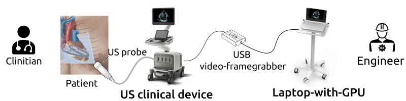

<h2 align="center">
	<p>
	AI-assisted echocardiography for low-resource countries  
	</p>
</h2>

<p align="center">	
	<a href="https://arxiv.org/abs/2212.14510">
        
	</a>
	<a href="https://github.com/vital-ultrasound/ai-echocardiography-for-low-resource-countries/releases">
        
	</a>
	<a href="https://github.com/vital-ultrasound/ai-echocardiography-for-low-resource-countries/blob/main/CODE_OF_CONDUCT.md">
        
	</a>
	<a href="https://zenodo.org/badge/latestdoi/ADDLINK">
	
	</a>
</p>

<p align="center">
This work is 100% Reproducible, lead by https://github.com/mxochicale 
</p>

## Summary 
This repository contains documentation and code for AI-assisted echocardiography for low-resource countries.
This work is based on the total product lifecycle (TPLC) approach on AI/ML workflow from [Good Machine Learning Practices](scripts/learning-pipeline) established by the U.S. Food and Drug Administration, Health Canada, and the UK's Medicines and Healthcare products Regulatory Agency (MHRA).

## Data collection, validation and management [:open_file_folder:](data/)
1. Video data from GE Venue Go GE and Probe 3SC-RS was collected  with Portable Video Recorder. See [more](data/rawdata).
2. Creation and verification of annotations with VGG Image Annotator (VIA) software. See [more](data/labelling).
3. Jupyter notebook :notebook: for [data curation, selection and validation](scripts/curation-selection-validation); 
     
_**Fig 1.** Workflow for data annotation and validation._

## Deep learning pipeline
1. Model selection (MobileNetV1, MobileNetV2, SqueezeNet, EfficientNet, SqueezeNet, AlexNet, etc). See [more](source/models/architectures.py).
2. Model training and tuning (Fig. 2). See [more](scripts/learning-pipeline).
3. Model validation (performance evaluation and clinical evaluation). 
4. AI-based device modification, and (perhaps) AI-based production model . 
     
_**Fig 2.** Deep learning pipeline of the AI-empowered echocardiography._

## AI-based research system
Figure 3 illustrates the real-time AI-empowered clinical system based on [EPIQ 7 ultrasound](https://www.usa.philips.com/healthcare/product/HC795200C/epiq-7-ultrasound-system-for-cardiology), [X5-1 xMATRIX array transducer ](https://www.philips.co.uk/healthcare/product/HC989605400801/x5-1) and [USB framegrabber MiraBox Video Capture](https://miraboxbuy.com/collections/new-arrivals/products/hsv3211-video-capture-card).
The software of the system is based on [Machine learning pipeline](scripts/learning-pipeline) and [Plug-in based, Real-time Ultrasound](source/PRETUS_Plugins). 
See further details [here](docs) on laptop hardware, OS and software of the system.

    
_**Fig 3.** Real-time AI-empowered clinical system._  


## Licence and Citation 
This work is under Creative Commons Attribution-Share Alike license [](https://creativecommons.org/licenses/by-sa/4.0/). 
Hence, you are free to reuse it and modify it as much as you want and as long as you cite [this work](https://github.com/budai4medtech/miua2022) as original reference and you re-share your work under the same terms.

## Clone repository
After generating your SSH keys as suggested [here](https://docs.github.com/en/authentication/connecting-to-github-with-ssh/generating-a-new-ssh-key-and-adding-it-to-the-ssh-agent), you can then clone the repository by typing (or copying) the following lines in a terminal:
```
mkdir -p $HOME/repositories/vital-ultrasound  && cd $HOME/repositories/vital-ultrasound
git clone git@github.com:vital-ultrasound/ai-echocardiography-for-low-resource-countries.git
```

### BibTeX to cite
```
@misc{https://doi.org/10.48550/arxiv.2212.14510,
  author = {Xochicale, Miguel and 
	    Thwaites, Louise and 
            Yacoub, Sophie and 
            Pisani, Luigi and 
            Phung, Tran Huy Nhat and 
            Kerdegari, Hamideh and 
            King, Andrew and 
            Gomez, Alberto}, 
  title = {A Machine Learning Case Study for AI-empowered echocardiography of 
           Intensive Care Unit Patients in low- and middle-income countries},
  doi = {10.48550/ARXIV.2212.14510},
  url = {https://arxiv.org/abs/2212.14510},
  keywords = {Medical Physics (physics.med-ph), 
	      Machine Learning (cs.LG), 
	      Image and Video Processing (eess.IV), 
              FOS: Physical sciences, 
	      FOS: Computer and information sciences, 
	      FOS: Electrical engineering, electronic engineering, information engineering},
  publisher = {arXiv},
  year = {2022},
  copyright = {Creative Commons Attribution 4.0 International}
}
```

## Contributors
Thanks goes to all these people ([emoji key](https://allcontributors.org/docs/en/emoji-key)):  
<!-- ALL-CONTRIBUTORS-LIST:START - Do not remove or modify this section -->
<!-- prettier-ignore-start -->
<!-- markdownlint-disable -->

<table>
  <tr>
    <td align="center"><a href="https://github.com/mxochicale"><br /><sub><b>Miguel Xochicale</b></sub>           </a><br /><a href="https://github.com/vital-ultrasound/echocardiography/commits?author=mxochicale" title="Code">💻 🔬 🤔 </a> <a href="https://github.com/fepegar/torchio/commits?author=mxochicale" title="Documentation">📖</a></td>
    <td align="center"><a href="https://github.com/hamidehkerdegari"><br /><sub><b>Hamideh Kerdegari </b></sub>   </a><br /><a href="https://github.com/vital-ultrasound/echocardiography/commits?author=hamidehkerdegari" title="Code">💻</a> </td>
    <td align="center"><a href="https://github.com/huynhatd13"><br /><sub><b>Nhat Phung Tran Huy</b></sub>        </a><br /><a href="https://github.com/vital-ultrasound/echocardiography/commits?author=huynhatd13" title="Code">💻</a></td>
    <td align="center"><a href="https://github.com/"><br /><sub><b>Louise Thwaites</b></sub>        </a><br /><a href="https://github.com/vital-ultrasound/echocardiography/commits?author=" title="Research">  🔬 🤔  </a></td>
    <td align="center"><a href="https://github.com/"><br /><sub><b>Sophie Yacoub</b></sub>        </a><br /><a href="https://github.com/vital-ultrasound/echocardiography/commits?author=" title="Research">  🔬 🤔  </a></td>
    <td align="center"><a href="https://github.com/atoandy"><br /><sub><b>Andrew King</b></sub>        </a><br /><a href="https://github.com/vital-ultrasound/nnUNet-for-PRETUS/commits?author=atoandy" title="Research">  🔬🤔  </a></td>
    <td align="center"><a href="https://github.com/gomezalberto"><br /><sub><b>Alberto Gomez</b></sub>             </a><br /><a href="https://github.com/vital-ultrasound/echocardiography/commits?author=gomezalberto" title="Code">💻</a></td>
  </tr>
</table>
<!-- markdownlint-restore -->
<!-- prettier-ignore-end -->

<!-- ALL-CONTRIBUTORS-LIST:END -->

This work follows the [all-contributors](https://github.com/all-contributors/all-contributors) specification. 
Contributions of any kind welcome!

## Contact and issue report
If you have specific questions about the content of this repository, you can contact [Miguel Xochicale](https://github.com/mxochicale). 
If your question might be relevant to other people, please instead [open an issue](https://github.com/vital-ultrasound/ai-assisted-echocardiography-for-low-resource-countries/issues).  
