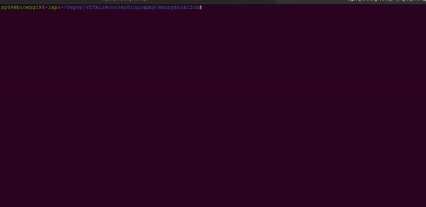

# Anonymisation of Sonosite videos

## ffmpeg based method
There are two scripts: `anonymize_video.sh` and `anonymize_video_blackblock.sh`. 
The first blacks out everything except for a box defined by the input bounds, the second blacks out a box defined by the input bounds.

1. `anonymize_video.sh`   
Run the script
```
bash anonymize_video.sh videoin.mp4 video_anonymized.mp4 A B C D
```
where `videoin` is the original video, `video_anonymized` is the anonymized video with a black frame around the ultrasound image, and `A`, `B`, `C`, and `D` are the bounds (in pixels) of the inside image, as shown below.
The coloured boxes will appear black -colours are only for illustration.
blocks can be removed by selecting a the values of `A`, `B`, `C`, and `D` accordingly. In the picture below, the values were 300 1550 60 850.  


2. `anonymize_video_blackblock.sh`  
Run the script
```
bash anonymize_video_blackblock.sh videoin.mp4 video_anonymized.mp4 A B C D
```
where `videoin` is the original video, `video_anonymized` is the anonymized video with a black frame around the ultrasound image. 
`A`, `B`, `C`, and `D` are the bounds (in pixels) of the block to be blacked out, as shown below.   


blocks can be removed by selecting a the values of `A`, `B`, `C`, and `D` accordingly. 
In the picture below, the values were 300 1550 60 850.

## OpenCV python-based method (slower)
This uses opencv. 
Edit the code to enter the original video nam,e and the output name. 
If you know the crop box, you can also pass it as argument, otherwise a window will show for you to select the region to be preserved.

TODO: pass input parameters by argument.




