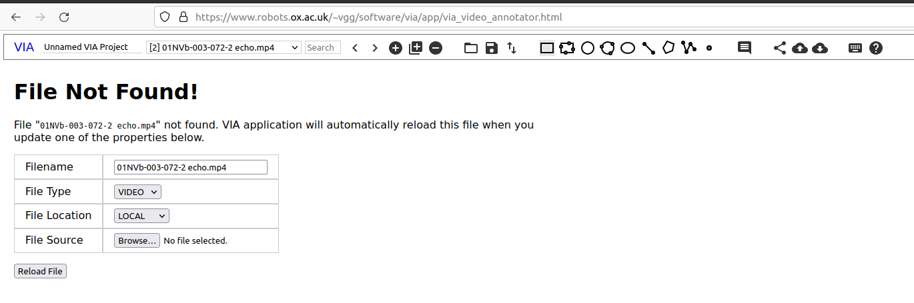
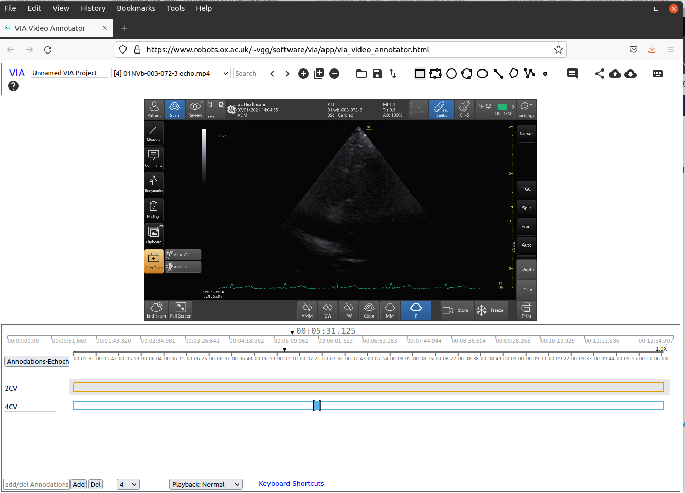

# Labelling ultrasound echochardiograhy datasets.
The following are instructions for user to label and annotate timestamps of Four Chamber View (4CV) and Ejection Fraction (EF) of ultrasound echocardiography datasets.

## 1. Download datasets
**1.1** Download datasets from the filezilla server which are located at `/01NVb/01NVb/Group 1-ECHO + LUS`.
It is suggested that you create a path for datasets as showing below:
``` 
cd /media/$USER/vitaluskcl/datasets/echocardiography/videos-echo-annotated-33-subjects/ ## change path  
mkdir -p 01NVb-003-072/T1 ## participant name and T1 for day 01
```
Then you can download the following files from filezilla:
``` 
 /01NVb/01NVb/Group 1-ECHO + LUS/01NVb-003-070/T1/01NVb-003-072-1 echo.mp4
 /01NVb/01NVb/Group 1-ECHO + LUS/01NVb-003-070/T2/01NVb-003-072-2 echo.mp4
 /01NVb/01NVb/Group 1-ECHO + LUS/01NVb-003-070/T3/01NVb-003-072-3 echo.mp4
```

**1.2** Save files in your local machine.
For instance, files are organised as follows where "mx19@sie113-lap" is the username with machine name:
``` 
mx19@sie133-lap:/media/mx19/vitaluskcl/datasets/echocardiography/videos-echo-annotated-33-subjects$ tree -s
.
├── [      32768]  01NVb-003-040
│   ├── [      32768]  T1
│   │   ├── [       1070]  01nvb-003-040-1-4cv.json
│   │   └── [  985197916]  01NVb-003-040-1 echo.mp4
│   ├── [      32768]  T2
│   │   ├── [        990]  01nvb-003-040-2-4cv.json
│   │   └── [ 1378718854]  01NVb-003-040-2 echo.mp4
│   └── [      32768]  T3
├── [      32768]  01NVb-003-041
│   ├── [      32768]  T1
│   │   ├── [        990]  01nvb-003-041-1-4cv.json
│   │   └── [ 1146822377]  01NVb-003-041-1 echo.mp4
│   ├── [      32768]  T2
│   │   ├── [        990]  01nvb-003-041-2-4cv.json
│   │   └── [  654004200]  01NVb-003-041-2 echo.mp4
│   └── [      32768]  T3
│       ├── [       1148]  01nvb-003-041-3-4cv.json
│       ├── [  106323225]  01NVb-003-041-3 echo cont_mp4_
│       └── [  621610199]  01NVb-003-041-3 echo.mp4
├── [      32768]  01NVb-003-042
│   ├── [      32768]  T1
│   │   ├── [        906]  01nvb-003-042-1-4cv.json
│   │   └── [ 1169134134]  01NVb-003-042-1 echo.mp4
│   ├── [      32768]  T2
│   │   ├── [        906]  01nvb-003-042-2-4cv.json
│   │   └── [  725567484]  01NVb-003-042-2 echo.mp4
│   └── [      32768]  T3
│       ├── [       1072]  01nvb-003-042-3-4cv.json
│       └── [  809756791]  01NVb-003-042-3 echo.mp4

```

## 2. Use VIA software to annotate timestamps in video files.
**2.1** Open the [VIA software](https://www.robots.ox.ac.uk/~vgg/software/via/app/via_video_annotator.html) in your favorite internet web-browser (tested in firefox-92.0 (64-bit) in Ubuntu20.04).       
**2.2** Open json files are saved in this repository and are located at:   
```
mx19@sie133-lap:/media/mx19/vitaluskcl/datasets/echocardiography/videos-echo-annotated-33-subjects/01NVb-003-052/T1$ ls -lr
total 930976
-rw-r--r-- 1 mx19 mx19 953257316 Jan 26  2022 '01NVb-003-052-1 echo.mp4'
-rw-r--r-- 1 mx19 mx19       990 Aug 12 15:29  01NVb-003-052-1-4CV.json
```
**NOTE** you can bookmark the path of your files in 'nautiulus', file browsers, to have a quicker accessibility to the files.

**2.3** Select paths of video files and verify annotations. 


**NOTE** you can bookmark the path of your files in 'nautiulus', file browsers, to have a quicker accessibility to the files.

**2.4** Verify annotations   
With your mouse scroll the time line of the video to verify annotation(s).


**2.5** Save annotations in json files and only leave two json files (last most updates files).     
**NOTE** you can bookmark the path of your files in 'nautiulus', file browsers, to have a quicker accessibility to the files.  

See [README](json_files/README.md) in json_files path for further details. 

## 3. Validate datasets using jupyter notebook
Run [validation-of-4cv-labels.ipynb](../../scripts/curation-selection-validation/validation-of-4cv-labels.ipynb), see further documentations [here](../../scripts/curation-selection-validation).

## References
* [VGG Image Annotator (VIA)](https://www.robots.ox.ac.uk/~vgg/software/via/)
* [VIA software](https://www.robots.ox.ac.uk/~vgg/software/via/app/via_video_annotator.html)
* [Echocardiography Essentials: Mastering the apical four-chamber view (4CV)](https://www.youtube.com/watch?v=KNrumyLdTGs)  

