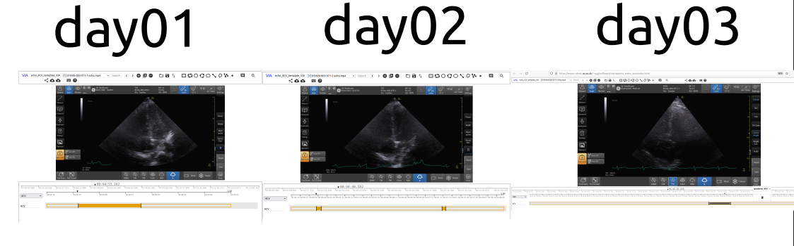

# Annotated video files in json files

## Logs
* [25Oct2021-08h31h00s]: Miguel Xochicale performed verification and documentation
* [13Oct2021-05h30m00s]; Nhat Phug added annotations 
* [13Oct2021-12h20m00s]; Miguel Xochicale performed verification and documentation  

## Timeline of the annotations 


## Metadata in json files
To see metadata of json files, please open them in your web-browser.

* 01NVb_003_072/01NVb_003_07X_T1_4CV.json
```
metadata	
1_yn55XtFN	
vid	"1"
flg	0
z	
0	295.19215
1	297.57965
xy	[]
av	
1	"4CV"
``` 

* /01NVb_003_072/01NVb_003_07X_T2_4CV.json
```

metadata	
1_vLf9kBXH	
vid	"1"
flg	0
z	
0	286.991
1	292.829
xy	[]
av	
1	"4CV"
1_mAqPTQBs	
vid	"1"
flg	0
z	
0	441.62312
1	446.24077
xy	[]
av	
1	"4CV"
```

* /01NVb_003_072/01NVb_003_07X_T3_4CV.json
``` 
metadata	
1_hfqFXtQ4	
vid	"1"
flg	0
z	
0	364.16279
1	367.67595
xy	[]
av	
1	"4CV"	

```  


## CODEC ERRORS

``` 
[h264 @ 0x5638c5d94000] Invalid NAL unit size (0 > 2168).
[h264 @ 0x5638c5d94000] Error splitting the input into NAL units.
[h264 @ 0x5638c5d77240] cbp too large (58) at 2 41
[h264 @ 0x5638c5d77240] error while decoding MB 2 41
[h264 @ 0x5638c5dcdb80] No start code is found.
[h264 @ 0x5638c5dcdb80] Error splitting the input into NAL units.
[h264 @ 0x5638c5dea940] No start code is found.
[h264 @ 0x5638c5dea940] Error splitting the input into NAL units.
Invalid UE golomb code
[h264 @ 0x5638c5db0dc0] cbp too large (3199971767) at 73 52
[h264 @ 0x5638c5db0dc0] error while decoding MB 73 52
[h264 @ 0x5638c5e07700] No start code is found.
[h264 @ 0x5638c5e07700] Error splitting the input into NAL units.
[h264 @ 0x5638c5e244c0] No start code is found.
[h264 @ 0x5638c5e244c0] Error splitting the input into NAL units.

```