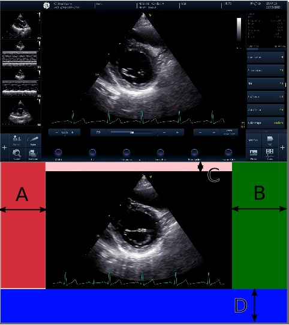
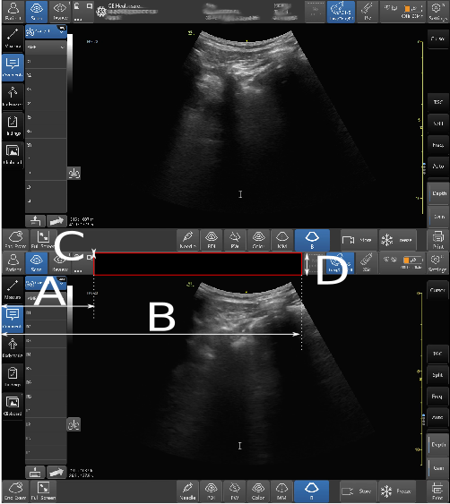

# Video anonymisa1tion of ultrasound data

## ffmpeg-based method (faster)
There are two scripts: `anonymise_video.sh` and `anonymise_video_blackblock.sh`. 
The first blacks out everything except for a box defined by the input bounds, the second blacks out a box defined by the input bounds.

### 1. `anonymise_video.sh`   
Run the script
```
bash anonymize_video.sh videoin.mp4 video_anonymized.mp4 A B C D
```
where `videoin.mp4` is the original video, `video_anonymized.mp4` is the anonymised video with a black frame around the ultrasound image, and `A`, `B`, `C`, and `D` are the bounds (in pixels) of the inside image. 
See this example: 
```
bash anonymise_video.sh $HOME/datasets/vital-us/raw-datasets/01NVb-003-001/T1/01NVb-003-001-echo.mp4 $HOME/datasets/vital-us/preprocessed-datasets/01NVb-003-001-echo-anonymised.mp4 250 1700 80 900 
```
where `$HOME` is the concatenated  home with user paths. 
 
  
**Figure 1** The coloured boxes will appear black -colours are only for illustration and bounds (in pixels) are 300 1550 60 850. 

### 2. `anonymise_video_blackblock.sh`  
Run the script
```
bash anonymise_video_blackblock.sh videoin.mp4 video_anonymized.mp4 A B C D
```
where `videoin` is the original video, `video_anonymized` is the anonymized video with a black frame around the ultrasound image. 
`A`, `B`, `C`, and `D` are the bounds (in pixels) of the block to be blacked out, as shown below.   
See this example: 
```
bash anonymise_video_blackblock.sh $HOME/datasets/vital-us/raw-datasets/01NVb-003-001/T1/01NVb-003-001-echo.mp4 $HOME/datasets/vital-us/preprocessed-datasets/01NVb-003-001-echo-anonymised.mp4 250 1700 80 250 
```
where `$HOME` is the concatenated  home with user paths.

  
**Figure 2** The coloured boxes will appear black -colours are only for illustration and bounds (in pixels) are 300 1550 60 850.

## openCV-based method (slower)
Run the script with the use of your virtual environment
``` 
conda activate ve-AICO
python anonimise_video_using_opencv.py --videofile_in $HOME/datasets/vital-us/raw-datasets/01NVb-003-001/T1/01NVb-003-001-echo.mp4 --videofile_out $HOME/datasets/vital-us/preprocessed-datasets/tmp/01NVb-003-001-echo-anonymised.mp4 --bounds 331 107 1477 823  
``` 
The script show a window where you will select the region or interest to be preserved.  
Otherwise, you can also pass it as argument `bounds = 76, 28, 526, 421`.   
