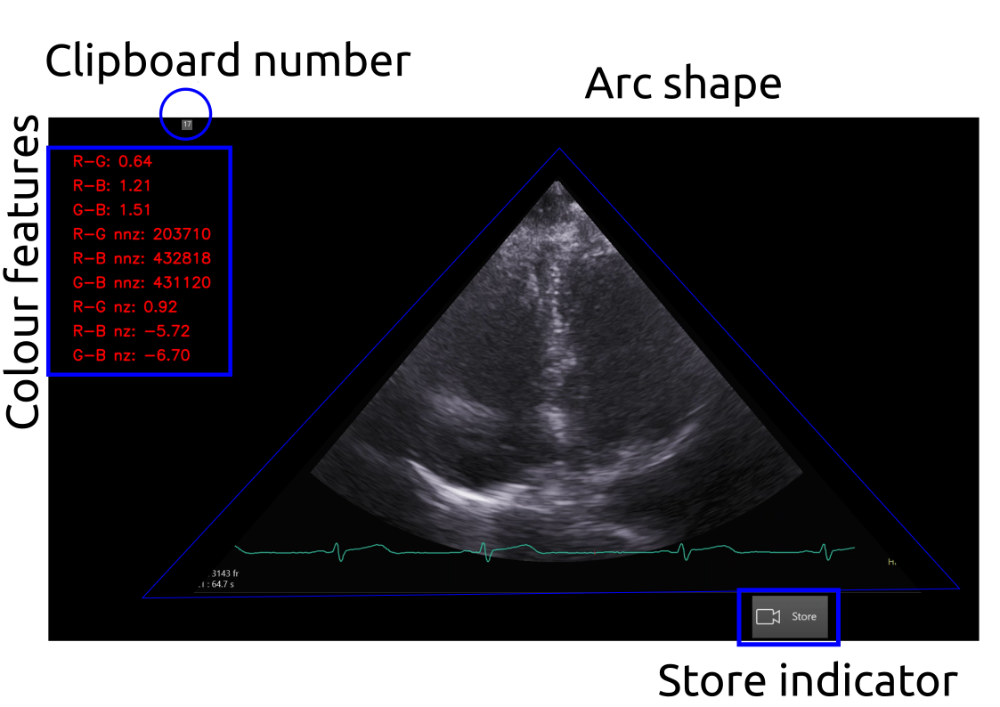

# Curation and selection of US imaging datasets
Python scripts made use of the `rt-ai-echo-VE` virtual environment which should be started in the terminal as `conda activate rt-ai-echo-VE`.
* Datasets in the local machine are in the following locations:
cd $HOME/datasets/vital-us/echocardiography/videos/01NVb-003-072/T1
cd $HOME/datasets/vital-us/echocardiography/preprocessed-datasets/tmp/nframes__

## `video_to_imageframes.py`
The script convers mp4 videos to png image frames of masked videos.



``` 
conda activate rt-ai-echo-VE
cd $HOME/vital-us/echocardiography/datasets/curation-and-selection

# 01NVb-003-070/
python video_to_imageframes.py --videofile_in $HOME/datasets/vital-us/echocardiography/videos/01NVb-003-070/T1/01NVb-003-070-1\ echo.mp4 --image_frames_path $HOME/datasets/vital-us/echocardiography/preprocessed-datasets/tmp/nframes__ --bounds 331 107 1477 823
python video_to_imageframes.py --videofile_in $HOME/datasets/vital-us/echocardiography/videos/01NVb-003-070/T2/01NVb-003-070-2\ echo.mp4 --image_frames_path $HOME/datasets/vital-us/echocardiography/preprocessed-datasets/tmp/nframes__ --bounds 331 107 1477 823
python video_to_imageframes.py --videofile_in $HOME/datasets/vital-us/echocardiography/videos/01NVb-003-070/T3/01NVb-003-070-3\ echo.mp4 --image_frames_path $HOME/datasets/vital-us/echocardiography/preprocessed-datasets/tmp/nframes__ --bounds 331 107 1477 823

# 01NVb-003-071/
python video_to_imageframes.py --videofile_in $HOME/datasets/vital-us/echocardiography/videos/01NVb-003-071/T1/01NVb-003-071-1\ echo.mp4 --image_frames_path $HOME/datasets/vital-us/echocardiography/preprocessed-datasets/tmp/nframes__ --bounds 331 107 1477 823
python video_to_imageframes.py --videofile_in $HOME/datasets/vital-us/echocardiography/videos/01NVb-003-071/T2/01NVb-003-071-2\ echo.mp4 --image_frames_path $HOME/datasets/vital-us/echocardiography/preprocessed-datasets/tmp/nframes__ --bounds 331 107 1477 823
python video_to_imageframes.py --videofile_in $HOME/datasets/vital-us/echocardiography/videos/01NVb-003-071/T3/01NVb-003-071-3\ echo.mp4 --image_frames_path $HOME/datasets/vital-us/echocardiography/preprocessed-datasets/tmp/nframes__ --bounds 331 107 1477 823

# 01NVb-003-072/
python video_to_imageframes.py --videofile_in $HOME/datasets/vital-us/echocardiography/videos/01NVb-003-072/T1/01NVb-003-072-1\ echo.mp4 --image_frames_path $HOME/datasets/vital-us/echocardiography/preprocessed-datasets/tmp/nframes__ --bounds 331 107 1477 823
python video_to_imageframes.py --videofile_in $HOME/datasets/vital-us/echocardiography/videos/01NVb-003-072/T2/01NVb-003-072-2\ echo.mp4 --image_frames_path $HOME/datasets/vital-us/echocardiography/preprocessed-datasets/tmp/nframes__ --bounds 331 107 1477 823
python video_to_imageframes.py --videofile_in $HOME/datasets/vital-us/echocardiography/videos/01NVb-003-072/T3/01NVb-003-072-3\ echo.mp4 --image_frames_path $HOME/datasets/vital-us/echocardiography/preprocessed-datasets/tmp/nframes__ --bounds 331 107 1477 823
```


## `video2sliding-video.py`
Terminal commands:
```
conda activate rt-ai-echo-VE
cd $HOME/vital-us/echocardiography/datasets/curation-and-selection
python video_to_sliding_video.py --videofile_in $HOME/datasets/vital-us/raw-datasets/01NVb-003-001/T1/01NVb-003-001-echo.mp4 --videofile_out $HOME/datasets/vital-us/preprocessed-datasets/tmp/01NVb-003-001-echo-sliced.mp4 --bounds 100 100  
```


## `video_channel_measurement.py`
This script helps identify good pairs of images/labels and save them to a folder.   
Terminal commands:
``` 
conda activate rt-ai-echo-VE
cd $HOME/vital-us/echocardiography/datasets/curation-and-selection
python video_channel_measurement.py --videofile_in $HOME/datasets/vital-us/raw-datasets/01NVb-003-001/T1/01NVb-003-001-echo.mp4 --image_frames_path $HOME/datasets/vital-us/preprocessed-datasets/tmp/nframes_ --bounds 331 107 1477 823
```
