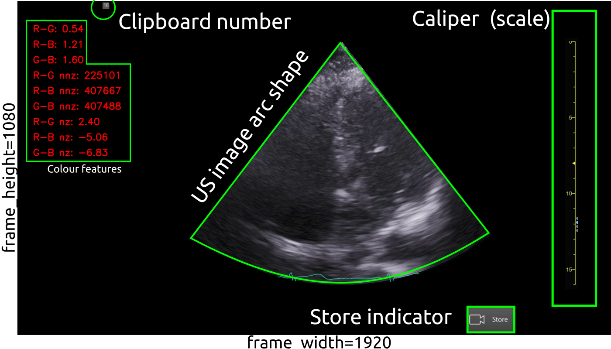

# Curation and selection of US imaging datasets
Python scripts made use of the `rt-ai-echo-VE` virtual environment which should be started in the terminal  (by typing or copying and paste) `conda activate rt-ai-echo-VE`. 
It it suggested that datasets in the local machine are placed in the following location:
``` 
cd $HOME/datasets/vital-us/echocardiography/videos/
```

## [`video_to_imageframes.py`](video_to_imageframes.py)
The script converts mp4 videos to png image frames of masked videos (Fig 1).

**Fig 1** Example of masks (green geometric forms) in the capture ultrasound image.

* Example for `01NVb-003-071/`  
Before running the script, make sure to edit [config.yml](config.yml) file with the right paths.
``` 
conda activate rt-ai-echo-VE
cd $HOME/vital-us/echocardiography/datasets/curation-and-selection
python video_to_imageframes.py --config config.yml  
```

* Terminal output for `01NVb-003-072/`
``` 
    Frame_height=1080,  frame_width=1920 fps=29.971317121291353 nframes=23285 
    ...
  Function 'Video_to_ImageFrame' executed in 54.9318s
```


* Terminal output for `01NVb-003-072/`
``` 
  Frame_height=1080,  frame_width=1920 fps=29.97151886813569 nframes=20129 
```


* Terminal output for `01NVb-003-073/`
``` 
  Frame_height=1080,  frame_width=1920 fps=29.971320446690754 nframes=23224 
```


## [`video2sliding-video.py`](video_to_sliding_video.py)
Terminal commands:
```
conda activate rt-ai-echo-VE
cd $HOME/vital-us/echocardiography/datasets/curation-and-selection
python video_to_sliding_video.py --videofile_in $HOME/datasets/vital-us/raw-datasets/01NVb-003-001/T1/01NVb-003-001-echo.mp4 --videofile_out $HOME/datasets/vital-us/preprocessed-datasets/tmp/01NVb-003-001-echo-sliced.mp4 --bounds 100 100  
```

## [`video_channel_measurement.py`](video_channel_measurement.py) 
This script helps identify good pairs of images/labels and save them to a folder.   
Terminal commands:
``` 
conda activate rt-ai-echo-VE
cd $HOME/vital-us/echocardiography/datasets/curation-and-selection
python video_channel_measurement.py --videofile_in $HOME/datasets/vital-us/raw-datasets/01NVb-003-001/T1/01NVb-003-001-echo.mp4 --image_frames_path $HOME/datasets/vital-us/preprocessed-datasets/tmp/nframes_ --bounds 331 107 1477 823
```