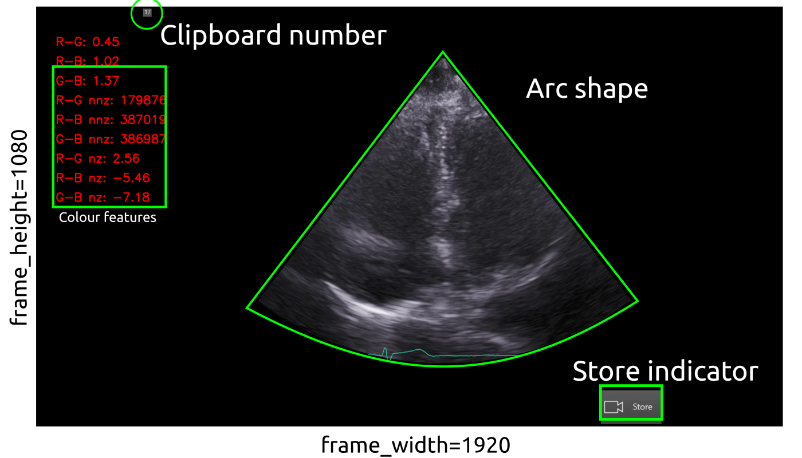

# Curation and selection of US imaging datasets
Python scripts made use of the `rt-ai-echo-VE` virtual environment which should be started in the terminal typing (or copying and paste) `conda activate rt-ai-echo-VE`. 
Datasets in the local machine are in the following location:
``` 
cd $HOME/datasets/vital-us/echocardiography/videos/01NVb-003-072/T1
```


## [`video_to_imageframes.py`](video_to_imageframes.py)
The script converts mp4 videos to png image frames of masked videos.


* Example for `01NVb-003-071/`  
``` 
conda activate rt-ai-echo-VE
cd $HOME/vital-us/echocardiography/datasets/curation-and-selection
python video_to_imageframes.py --videofile_in $HOME/datasets/vital-us/echocardiography/videos/01NVb-003-072/T1/01NVb-003-072-1\ echo.mp4 --image_frames_path $HOME/datasets/vital-us/echocardiography/preprocessed-datasets/01NVb-003-072/T1/imageframes 
```
* Terminal output for `01NVb-003-071/`
``` 
  
  Frame_height=1080,  frame_width=1920 fps=29.971317121291353 nframes=23285 
  
  Frame_index/number_of_frames=0/23285,  frame_timestamp=00:00:0.000
/home/mx19/datasets/vital-us/echocardiography/preprocessed-datasets/01NVb-003-072/T1/imageframes/nframes00000.png
Function 'maks_for_captured_us_image' executed in 0.0035s
  Frame_index/number_of_frames=1/23285,  frame_timestamp=00:00:33.367

...

  Frame_index/number_of_frames=23283/23285,  frame_timestamp=00:00:0.000
/home/mx19/datasets/vital-us/echocardiography/preprocessed-datasets/01NVb-003-072/T1/imageframes/nframes23283.png
Function 'maks_for_captured_us_image' executed in 0.0017s
  Frame_index/number_of_frames=23284/23285,  frame_timestamp=00:00:0.000
/home/mx19/datasets/vital-us/echocardiography/preprocessed-datasets/01NVb-003-072/T1/imageframes/nframes23284.png
Function 'maks_for_captured_us_image' executed in 0.0018s
Function 'Video_to_ImageFrame' executed in 1899.5256s

# > 1899.5256/60 31.658759999999997 minutes 
```


* Other participants 
``` 
# 01NVb-003-070/
python video_to_imageframes.py --videofile_in $HOME/datasets/vital-us/echocardiography/videos/01NVb-003-070/T1/01NVb-003-070-1\ echo.mp4 --image_frames_path $HOME/datasets/vital-us/echocardiography/preprocessed-datasets/tmp/nframes__ --bounds 331 107 1477 823
python video_to_imageframes.py --videofile_in $HOME/datasets/vital-us/echocardiography/videos/01NVb-003-070/T2/01NVb-003-070-2\ echo.mp4 --image_frames_path $HOME/datasets/vital-us/echocardiography/preprocessed-datasets/tmp/nframes__ --bounds 331 107 1477 823
python video_to_imageframes.py --videofile_in $HOME/datasets/vital-us/echocardiography/videos/01NVb-003-070/T3/01NVb-003-070-3\ echo.mp4 --image_frames_path $HOME/datasets/vital-us/echocardiography/preprocessed-datasets/tmp/nframes__ --bounds 331 107 1477 823

# 01NVb-003-071/
python video_to_imageframes.py --videofile_in $HOME/datasets/vital-us/echocardiography/videos/01NVb-003-071/T1/01NVb-003-071-1\ echo.mp4 --image_frames_path $HOME/datasets/vital-us/echocardiography/preprocessed-datasets/tmp/nframes__ --bounds 331 107 1477 823
python video_to_imageframes.py --videofile_in $HOME/datasets/vital-us/echocardiography/videos/01NVb-003-071/T2/01NVb-003-071-2\ echo.mp4 --image_frames_path $HOME/datasets/vital-us/echocardiography/preprocessed-datasets/tmp/nframes__ --bounds 331 107 1477 823
python video_to_imageframes.py --videofile_in $HOME/datasets/vital-us/echocardiography/videos/01NVb-003-071/T3/01NVb-003-071-3\ echo.mp4 --image_frames_path $HOME/datasets/vital-us/echocardiography/preprocessed-datasets/tmp/nframes__ --bounds 331 107 1477 823
```

## [`video2sliding-video.py`](video_to_sliding_video.py)
Terminal commands:
```
conda activate rt-ai-echo-VE
cd $HOME/vital-us/echocardiography/datasets/curation-and-selection
python video_to_sliding_video.py --videofile_in $HOME/datasets/vital-us/raw-datasets/01NVb-003-001/T1/01NVb-003-001-echo.mp4 --videofile_out $HOME/datasets/vital-us/preprocessed-datasets/tmp/01NVb-003-001-echo-sliced.mp4 --bounds 100 100  
```

[d](video_channel_measurement.py)
## `video_channel_measurement.py`
This script helps identify good pairs of images/labels and save them to a folder.   
Terminal commands:
``` 
conda activate rt-ai-echo-VE
cd $HOME/vital-us/echocardiography/datasets/curation-and-selection
python video_channel_measurement.py --videofile_in $HOME/datasets/vital-us/raw-datasets/01NVb-003-001/T1/01NVb-003-001-echo.mp4 --image_frames_path $HOME/datasets/vital-us/preprocessed-datasets/tmp/nframes_ --bounds 331 107 1477 823
```