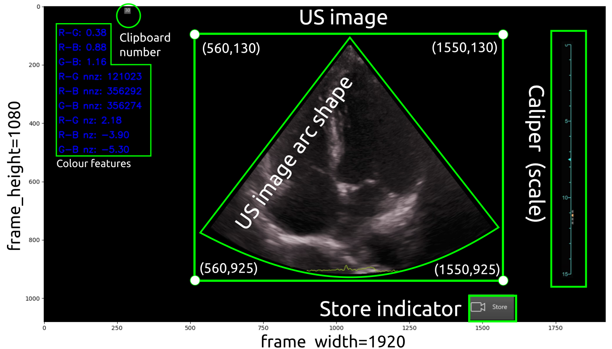

# Curation and selection of US imaging datasets
Python scripts made use of the `rt-ai-echo-VE` virtual environment which should be started in the terminal  (by typing or copying and paste) `conda activate rt-ai-echo-VE`. 
It is suggested that datasets in the local machine are placed in the following location:
``` 
cd $HOME/datasets/vital-us/echocardiography/videos-echo
```

## Scripts
### [`video_to_imageframes.py`](video_to_imageframes.py)
The script converts mp4 videos to png image frames of masked videos (Fig 1).

**Fig 1** Example of masks (green geometric forms) in the capture ultrasound image.

* Example for `01NVb-003-071/`  
Before running the script, make sure to edit [config.yml](config.yml) file with the right paths.
```
cd $HOME/repositories/echocardiography/datasets/curation-and-selection
conda activate rt-ai-echo-VE
python video_to_imageframes.py --config ../config_files/config_v2i.yml  
```

See output of convered frames at 


``` 
cd $HOME/datasets/vital-us/echocardiography/preprocessed-datasets
```

### [`png_to_avi.py`](png_to_avi.py)
Terminal commands:
```
conda activate rt-ai-echo-VE
cd $HOME/repositories/echocardiography/datasets/curation-and-selection
python png_to_avi.py --config ../config_files/config_i2v.yml
```


### [`video2sliding-video.py`](video_to_sliding_video.py)
Terminal commands:
```
conda activate rt-ai-echo-VE
cd $HOME/repositories/echocardiography/datasets/curation-and-selection
python video_to_sliding_video.py --videofile_in $HOME/datasets/vital-us/raw-datasets/01NVb-003-001/T1/01NVb-003-001-echo.mp4 --videofile_out $HOME/datasets/vital-us/preprocessed-datasets/tmp/01NVb-003-001-echo-sliced.mp4 --bounds 100 100  
```

### [`video_channel_measurement.py`](video_channel_measurement.py) 
This script helps identify good pairs of images/labels and save them to a folder.   
Terminal commands:
``` 
conda activate rt-ai-echo-VE
cd $HOME/repositories/echocardiography/datasets/curation-and-selection
python video_channel_measurement.py --videofile_in $HOME/datasets/vital-us/raw-datasets/01NVb-003-001/T1/01NVb-003-001-echo.mp4 --image_frames_path $HOME/datasets/vital-us/preprocessed-datasets/tmp/nframes_ --bounds 331 107 1477 823
```


## Curated datasets of Cropped Four Chamber View datasets
### Paths 
``` 
mx19@sie133-lap:~/datasets/vital-us/echocardiography/preprocessed-datasets/01NVb-003-072$ tree -d
.
├── T1
│   └── cropped_us_image
│       ├── animations
│       └── clip001
├── T2
│   └── cropped_us_image
│       ├── animations
│       ├── clip001
│       ├── clip002
│       └── clip003
└── T3
    └── cropped_us_image
        ├── animations
        ├── clip001
        └── clip002

15 directories
``` 

### Paths, filenames and human-readable size
```
mx19@sie133-lap:~/datasets/vital-us/echocardiography/preprocessed-datasets/01NVb-003-072$ tree -fh
.
├── [4.0K]  ./T1
│   └── [ 12K]  ./T1/cropped_us_image
│       ├── [491K]  ./T1/cropped_us_image/clip001_nframe11269_of_23284.png
│       ├── [492K]  ./T1/cropped_us_image/clip001_nframe11270_of_23284.png
│       ├── [491K]  ./T1/cropped_us_image/clip001_nframe11271_of_23284.png
│       ├── [478K]  ./T1/cropped_us_image/clip001_nframe11272_of_23284.png
│       ├── [509K]  ./T1/cropped_us_image/clip001_nframe11273_of_23284.png
│       ├── [523K]  ./T1/cropped_us_image/clip001_nframe11274_of_23284.png
│       ├── [524K]  ./T1/cropped_us_image/clip001_nframe11275_of_23284.png
│       ├── [529K]  ./T1/cropped_us_image/clip001_nframe11276_of_23284.png
│       ├── [529K]  ./T1/cropped_us_image/clip001_nframe11277_of_23284.png
│       ├── [525K]  ./T1/cropped_us_image/clip001_nframe11278_of_23284.png
│       ├── [503K]  ./T1/cropped_us_image/clip001_nframe11279_of_23284.png
│       ├── [490K]  ./T1/cropped_us_image/clip001_nframe11280_of_23284.png
│       ├── [509K]  ./T1/cropped_us_image/clip001_nframe11281_of_23284.png

...

│       ├── [561K]  ./T1/cropped_us_image/clip001_nframe11447_of_23284.png
│       └── [561K]  ./T1/cropped_us_image/clip001_nframe11448_of_23284.png
├── [4.0K]  ./T2
│   └── [ 20K]  ./T2/cropped_us_image
│       ├── [566K]  ./T2/cropped_us_image/clip001_nframe10610_of_20129.png
│       ├── [604K]  ./T2/cropped_us_image/clip001_nframe10611_of_20129.png
│       ├── [600K]  ./T2/cropped_us_image/clip001_nframe10612_of_20129.png
│       ├── [567K]  ./T2/cropped_us_image/clip001_nframe10613_of_20129.png
│       ├── [595K]  ./T2/cropped_us_image/clip001_nframe10614_of_20129.png
│       ├── [592K]  ./T2/cropped_us_image/clip001_nframe10615_of_20129.png
│       ├── [582K]  ./T2/cropped_us_image/clip001_nframe10616_of_20129.png
│       ├── [583K]  ./T2/cropped_us_image/clip001_nframe10617_of_20129.png
│       ├── [586K]  ./T2/cropped_us_image/clip001_nframe10618_of_20129.png
│       ├── [555K]  ./T2/cropped_us_image/clip001_nframe10619_of_20129.png


...


g
│       ├── [528K]  ./T2/cropped_us_image/clip001_nframe10785_of_20129.png
│       ├── [491K]  ./T2/cropped_us_image/clip001_nframe10786_of_20129.png
│       ├── [527K]  ./T2/cropped_us_image/clip001_nframe10787_of_20129.png
│       ├── [528K]  ./T2/cropped_us_image/clip001_nframe10788_of_20129.png
│       ├── [497K]  ./T2/cropped_us_image/clip001_nframe10789_of_20129.png
│       ├── [445K]  ./T2/cropped_us_image/clip002_nframe13967_of_20129.png
│       ├── [478K]  ./T2/cropped_us_image/clip002_nframe13968_of_20129.png
│       ├── [479K]  ./T2/cropped_us_image/clip002_nframe13969_of_20129.png
│       ├── [449K]  ./T2/cropped_us_image/clip002_nframe13970_of_20129.png
│       ├── [454K]  ./T2/cropped_us_image/clip002_nframe13971_of_20129.png


...


│       ├── [595K]  ./T2/cropped_us_image/clip002_nframe14051_of_20129.png
│       ├── [596K]  ./T2/cropped_us_image/clip002_nframe14052_of_20129.png
│       ├── [581K]  ./T2/cropped_us_image/clip002_nframe14053_of_20129.png
│       ├── [581K]  ./T2/cropped_us_image/clip002_nframe14054_of_20129.png
│       ├── [578K]  ./T2/cropped_us_image/clip002_nframe14055_of_20129.png
│       ├── [518K]  ./T2/cropped_us_image/clip003_nframe14086_of_20129.png
│       ├── [485K]  ./T2/cropped_us_image/clip003_nframe14087_of_20129.png
│       ├── [518K]  ./T2/cropped_us_image/clip003_nframe14088_of_20129.png
│       ├── [493K]  ./T2/cropped_us_image/clip003_nframe14089_of_20129.png
│       ├── [538K]  ./T2/cropped_us_image/clip003_nframe14090_of_20129.png
│       ├── [556K]  ./T2/cropped_us_image/clip003_nframe14091_of_20129.png
│       ├── [565K]  ./T2/cropped_us_image/clip003_nframe14092_of_20129.png
│       ├── [539K]  ./T2/cropped_us_image/clip003_nframe14093_of_20129.png
│       ├── [581K]  ./T2/cropped_us_image/clip003_nframe14094_of_20129.png
│       ├── [553K]  ./T2/cropped_us_image/clip003_nframe14095_of_20129.png


...


│       ├── [518K]  ./T2/cropped_us_image/clip003_nframe14171_of_20129.png
│       ├── [514K]  ./T2/cropped_us_image/clip003_nframe14172_of_20129.png
│       ├── [483K]  ./T2/cropped_us_image/clip003_nframe14173_of_20129.png
│       ├── [514K]  ./T2/cropped_us_image/clip003_nframe14174_of_20129.png
│       └── [511K]  ./T2/cropped_us_image/clip003_nframe14175_of_20129.png
└── [4.0K]  ./T3
    └── [ 12K]  ./T3/cropped_us_image
        ├── [477K]  ./T3/cropped_us_image/clip001_nframe09741_of_23224.png
        ├── [477K]  ./T3/cropped_us_image/clip001_nframe09742_of_23224.png
        ├── [476K]  ./T3/cropped_us_image/clip001_nframe09743_of_23224.png
        ├── [479K]  ./T3/cropped_us_image/clip001_nframe09744_of_23224.png
        ├── [468K]  ./T3/cropped_us_image/clip001_nframe09745_of_23224.png
        ├── [481K]  ./T3/cropped_us_image/clip001_nframe09746_of_23224.png
        ├── [482K]  ./T3/cropped_us_image/clip001_nframe09747_of_23224.png
        ├── [473K]  ./T3/cropped_us_image/clip001_nframe09748_of_23224.png
        ├── [483K]  ./T3/cropped_us_image/clip001_nframe09749_of_23224.png


        ├── [397K]  ./T3/cropped_us_image/clip002_nframe10574_of_23224.png
        ├── [420K]  ./T3/cropped_us_image/clip002_nframe10575_of_23224.png
        ├── [423K]  ./T3/cropped_us_image/clip002_nframe10576_of_23224.png
        ├── [407K]  ./T3/cropped_us_image/clip002_nframe10577_of_23224.png
        ├── [425K]  ./T3/cropped_us_image/clip002_nframe10578_of_23224.png
        └── [401K]  ./T3/cropped_us_image/clip002_nframe10579_of_23224.png

6 directories, 689 files

```

### Videos and gifs
```
mx19@sie133-lap:~/datasets/vital-us/echocardiography/preprocessed-datasets/01NVb-003-072/T2/cropped_us_image/animations$ tree -h
.
├── [ 10M]  clip001.avi
├── [ 42M]  clip001.gif
├── [5.1M]  clip002.avi
├── [ 21M]  clip002.gif
├── [5.3M]  clip003.avi
└── [ 21M]  clip003.gif

0 directories, 6 files
```