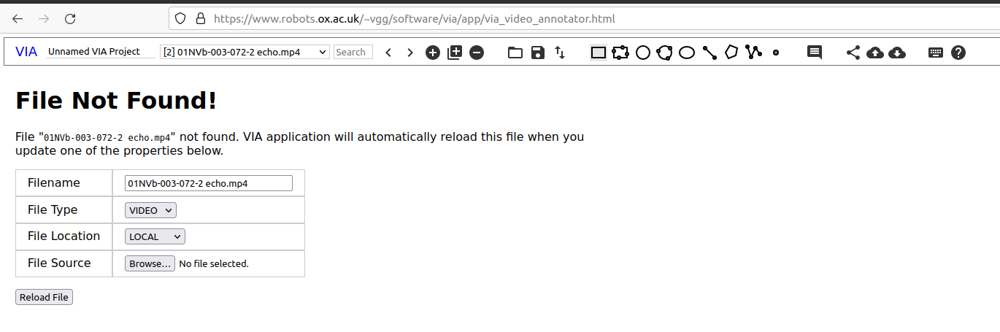
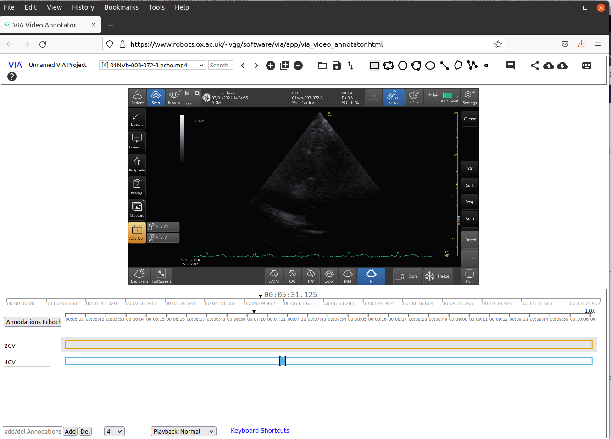

# Labelling and annotating ultrasound echochardiograhy datasets.
The following are instructions for user to label and annotate timestamps of Four Chamber View (4CV) and Ejection Fraction (EF) of ultrasound echocardiography datasets.

## 1. Download datasets
**1.1** Download datasets from the filezilla server which are located at `/01NVb/01NVb/Group 1-ECHO + LUS`.
It is suggested that you create a path for datasets as showing below:
``` 
cd 
mkdir -p $HOME/datasets/vital-us/echocardiography/videos-echo/ ## create path for datasets 
cd $HOME/datasets/vital-us/echocardiography/videos-echo/ ## change path  
mkdir -p 01NVb-003-072/T1 ## participant name and T1 for day 01
```
Then you can download the following files from filezilla:
``` 
 /01NVb/01NVb/Group 1-ECHO + LUS/01NVb-003-070/T1/01NVb-003-072-1 echo.mp4
 /01NVb/01NVb/Group 1-ECHO + LUS/01NVb-003-070/T2/01NVb-003-072-2 echo.mp4
 /01NVb/01NVb/Group 1-ECHO + LUS/01NVb-003-070/T3/01NVb-003-072-3 echo.mp4
```

**1.2** Save files in your local machine.
For instance, files are organised as follows where "mx19@sie113-lap" is the username with machine name:
``` 
mx19@sie133-lap:~/datasets/vital-us/echocardiography/videos-echo/01NVb-003-072$ tree -h
.
├── [4.0K]  T1
│   └── [1.3G]  01NVb-003-072-1-echo.mp4
├── [4.0K]  T2
│   ├── [1.2G]  01NVb-003-072-2-echo-cont.mp4
│   └── [4.0K]  extras
│       └── [238M]  01NVb-003-072-2-echo.mp4
└── [4.0K]  T3
    └── [1.1G]  01NVb-003-072-3-echo.mp4

4 directories, 4 files
```


## 2. Use VIA software to annotate videos.
**2.1** Open the [VIA software](https://www.robots.ox.ac.uk/~vgg/software/via/app/via_video_annotator.html) in your favorite internet web-browser (tested in firefox-92.0 (64-bit) in Ubuntu20.04).       
**2.2** Open json files are saved in this repository and are located at:   
```
:~/vital-us/echocardiography/datasets/labelling-annotation/json_files$ ls -lR
.:
total 4
-rw-rw-r-- 1 mx19 mx19 981 Oct  6 18:51 via_project_06Oct2021_18h51m11s.json
```
**NOTE** you can bookmark the path of your files in 'nautiulus', file browsers, to have a quicker accessibility to the files.

**2.3** Select paths of video files and verify annotations. 


**NOTE** you can bookmark the path of your files in 'nautiulus', file browsers, to have a quicker accessibility to the files.

**2.4** Verify annotations   
With your mouse scroll the time line of the video to verify annotation(s).


**2.5** Save annotations in json files and only leave two json files (last most updates files).     
**NOTE** you can bookmark the path of your files in 'nautiulus', file browsers, to have a quicker accessibility to the files.  

See [README](json_files/README.md) in json_files path for further details. 

## References
* [VGG Image Annotator (VIA)](https://www.robots.ox.ac.uk/~vgg/software/via/)
* [VIA software](https://www.robots.ox.ac.uk/~vgg/software/via/app/via_video_annotator.html)
* [Echocardiography Essentials: Mastering the apical four-chamber view (4CV)](https://www.youtube.com/watch?v=KNrumyLdTGs)  

