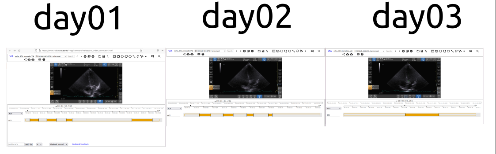

# Annotated json files

## Logs
* [13Oct2021-5AM]: Annotations by Nhat Phug 
* [13Oct2021-12PM]; Verification by Miguel Xochicale 

## Timeline of the annotations 


## Metadata in json files
To see metadata of json files, please open them in your web-browser.

* 01NVb_003_072/01NVb_003_07X_T1_4CV.json
```
metadata	
1_1nEVY4Ys	
vid	"1"
flg	0
z	
0	291.20307
1	293.57807
xy	[]
av	
1	"4CV"
1_wXdxEXhE	
vid	"1"
flg	0
z	
0	295.88164
1	298.50664
xy	[]
av	
1	"4CV"
1_aEEIH3Xp	
vid	"1"
flg	0
z	
0	301.239
1	302.88164
xy	[]
av	
1	"4CV"
1_Gw7F4XHU	
vid	"1"
flg	0
z	
0	319.4
1	325.09593
xy	[]
av	
1	"4CV"

``` 

* /01NVb_003_072/01NVb_003_07X_T2_4CV.json
```
metadata	
1_SxIJgqrX	
vid	"1"
flg	0
z	
0	291.12287
1	293.6062
xy	[]
av	
1	"4CV"
1_E2QeVMaT	
vid	"1"
flg	0
z	
0	296.23953
1	298.4062
xy	[]
av	
1	"4CV"
1_RwXqqxKH	
vid	"1"
flg	0
z	
0	305.93953
1	306.77287
xy	[]
av	
1	"4CV"
1_m1g4G2Rf	
vid	"1"
flg	0
z	
0	301.32287
1	302.73953
xy	[]
av	
1	"4CV"
```

* /01NVb_003_072/01NVb_003_07X_T3_4CV.json
``` 
metadata	
1_WlBMu3ph	
vid	"1"
flg	0
z	
0	428.41724
1	432.50547
xy	[]
av	
1	"4CV"


```  
