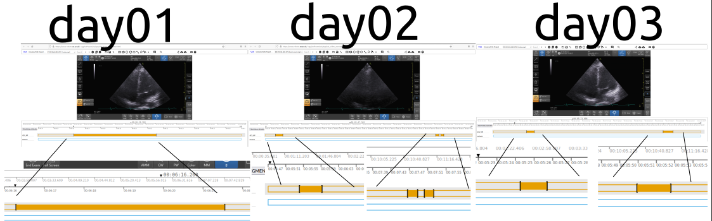

# Annotated json files 
This path contains json files of different participants.
The following is an example of the content of each participant. 

## Participant Number 
Please, use this naming

for new json files. 
Please rewrite jason files and be sure to add an commit message using `#IssueNumer annotation type and initial of Name and Surname of the annorator` to be sure all changes can be tracked.
### Log
* [insert-date-time]: Name LastName and short description 
* e.g. [12Oct2021_11h58m00s]: Nhat Phung verified json files for each day.

### Timeline figure  
e.g. 


### Metadata in json files
To see metadata of json files, please open them in your web-browser.
Example: 
* 01NVb_003_072/01NVb_003_072_T1_4CV.json
```
metadata	
1_BXLfdQfa	
vid	"1"
flg	0
z	
0	376.279
1	381.54942
xy	[]
av	
1	"4CV_NP"
``` 
