 # Frame resolutions tests
Test of different image size and frame rates. 

The following images were obtained with [`python framegrabber_capturing_video.py --fW 1024 --fH 768 --FPS 60 --buffer_size `](../../scripts/hardware/) 

## Using X5-1 probe 

* W640H480PS60  
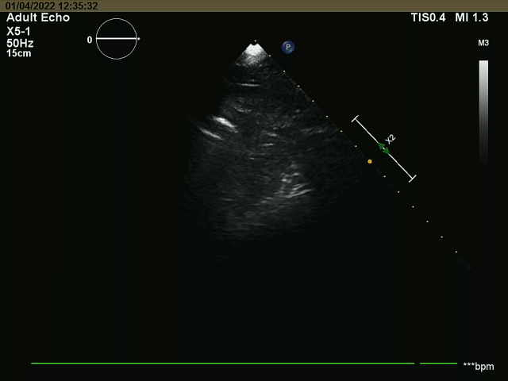

* W800H600FPS60  
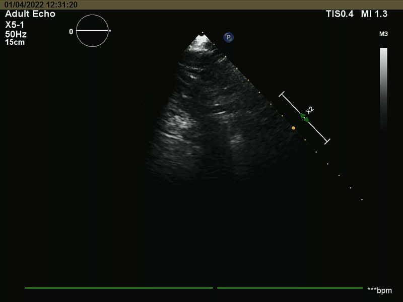

* W960H540PS60  
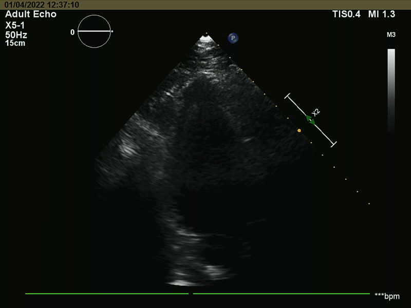

* W1280H720PS60  
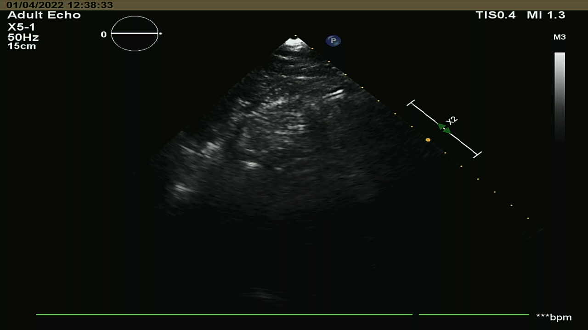

* W1920H1080PS60  
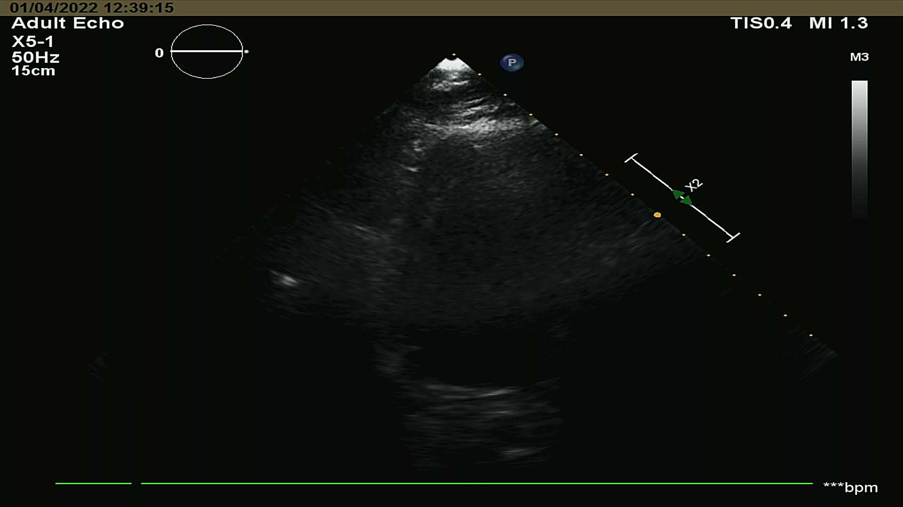

  
* adultecho:
  * _W1280H960FPS30_MJPG
  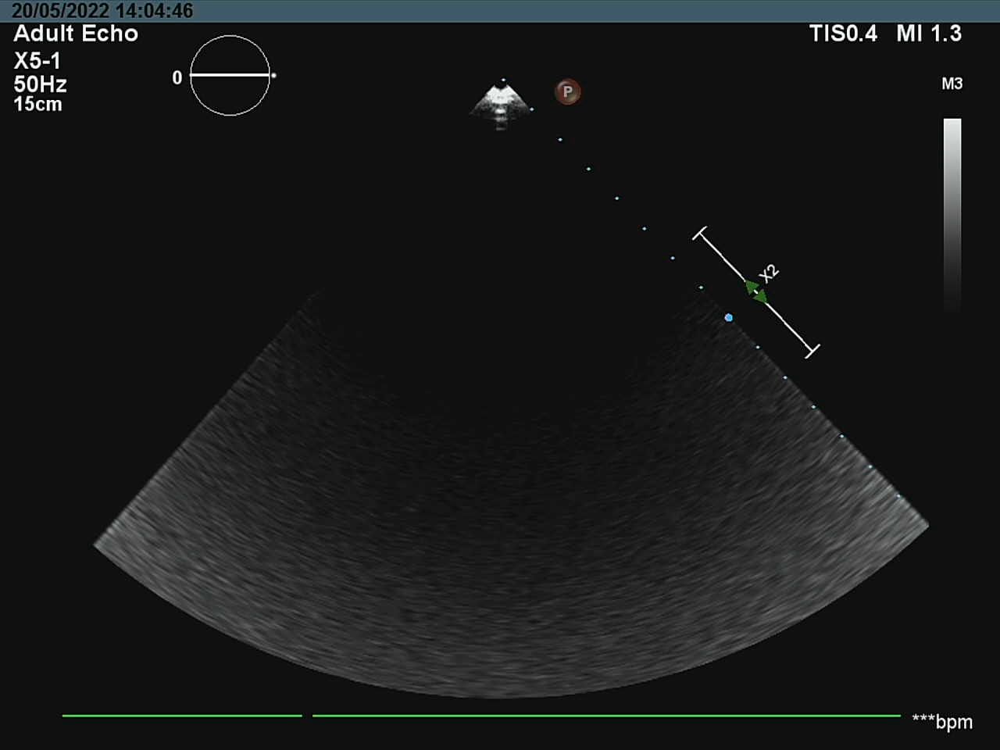
  * _W1280H960FPS60_MJPG
  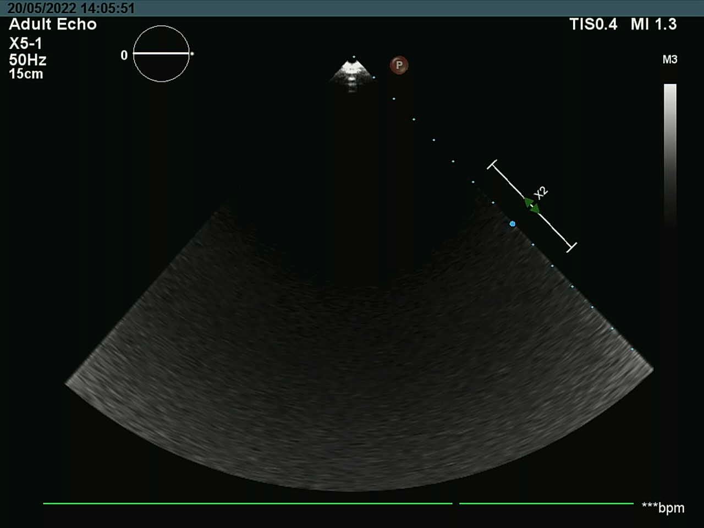
  
* echopen 
  * _W1280H960FPS30_MJPG
  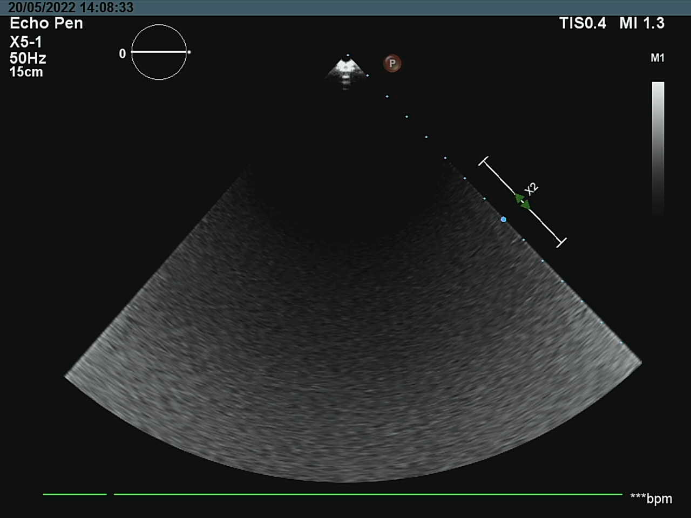
  * _W1280H960FPS60_MJPG
  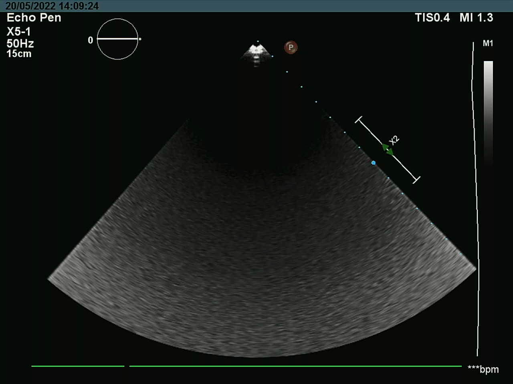

* AbdVasc
  * _W1280H960FPS60_MJPG
  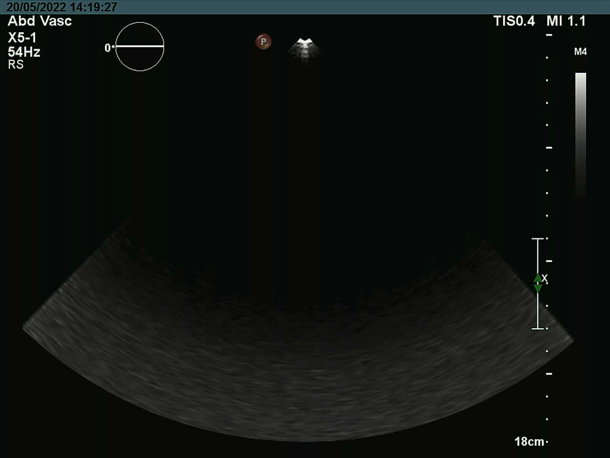

* TCD
  * _W1280H960FPS60_MJPG
  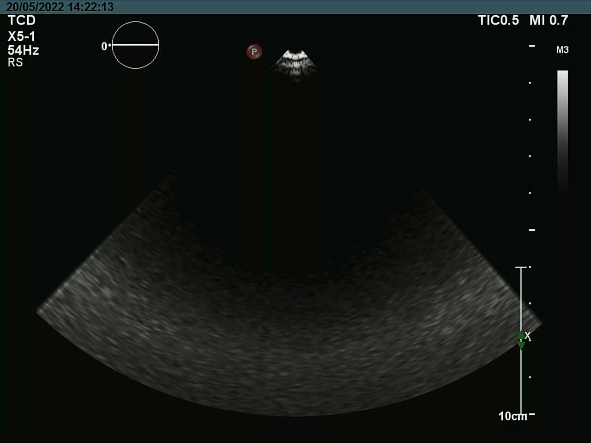

## Using X6-1 probe 

* frame_screenshot_W1280H960FPS30_MJPG
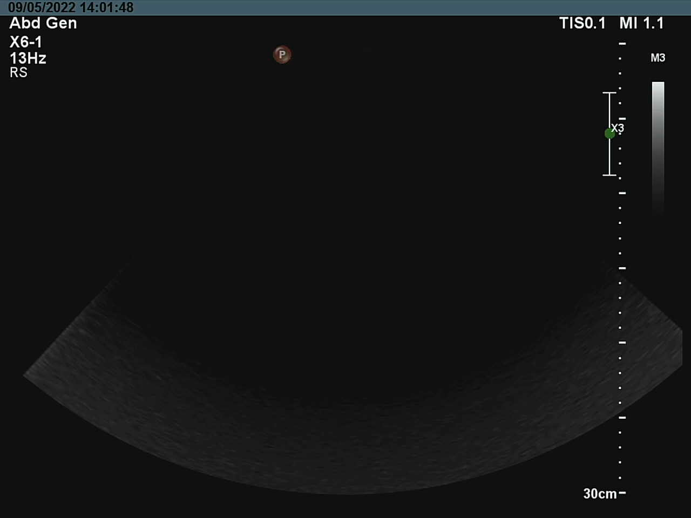

* frame_screenshot_W1280H960FPS60_MJPG
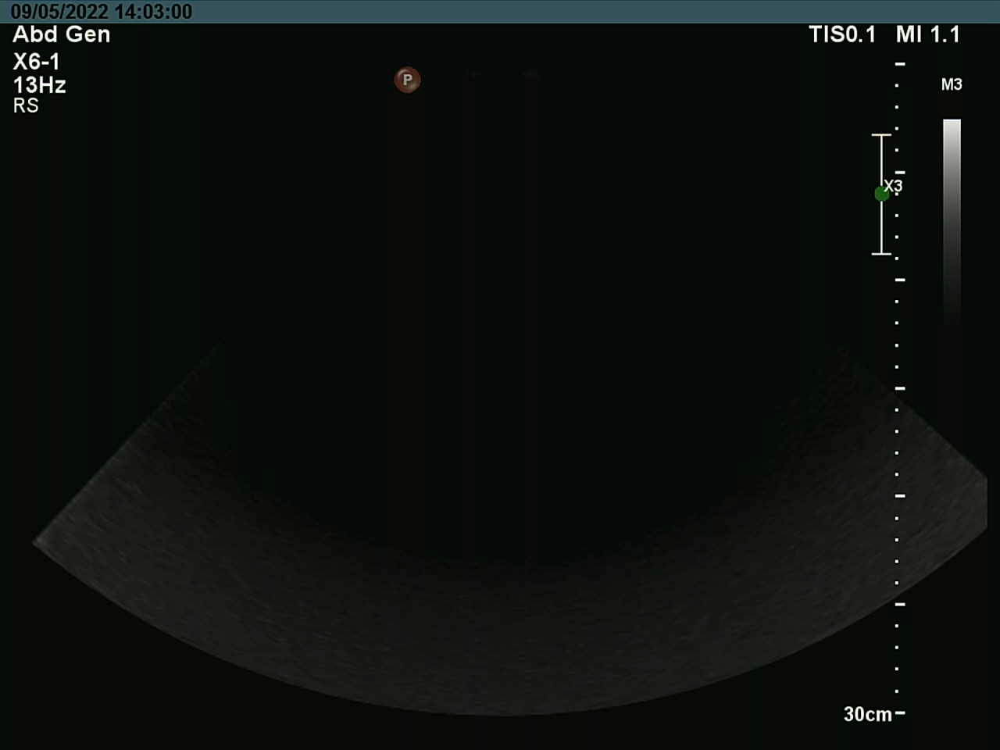

* frame_screenshot_W1024H768FPS60_MJPG
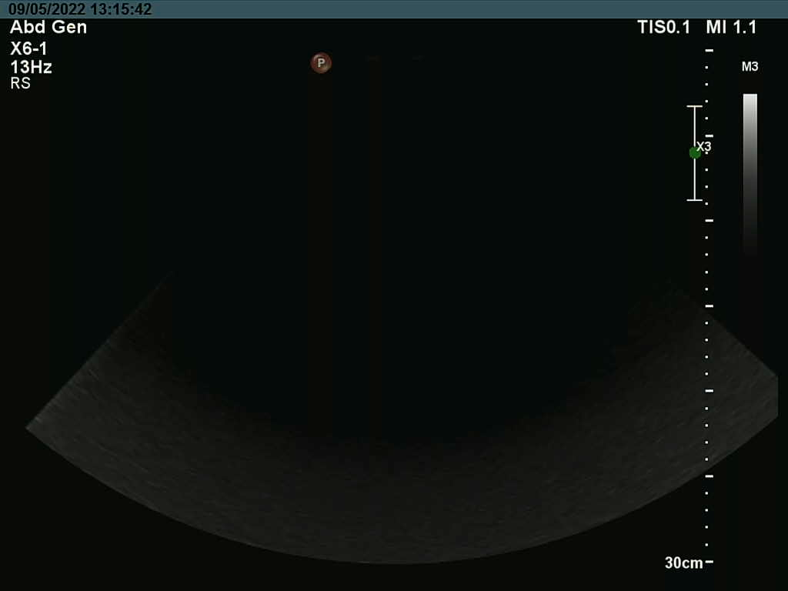

