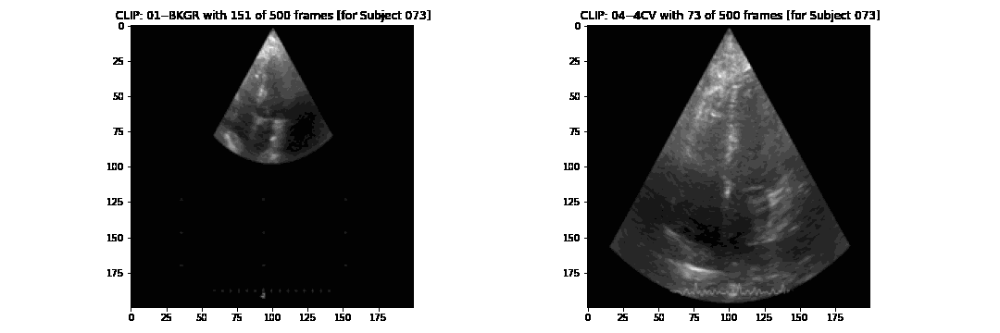
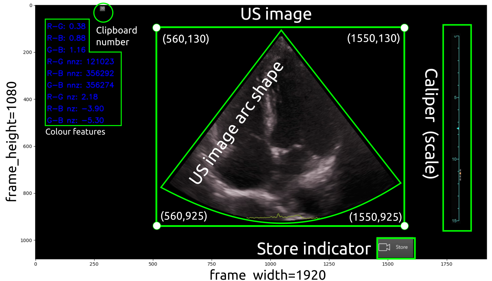

# Curation, selection and validation of US imaging datasets

## 1. Datasets file organisation and localisation 
It is suggested that datasets in the local machine are placed in the following location:
``` 
cd $HOME/datasets/vital-us/echocardiography/videos-echo-annotated
```
Alternatively, data can also be located in a portable hard-drive, e.g.:
``` 
cd /media/mx19/vitaluskcl/datasets/echocardiography/
```

<details>
  <summary>Click to expand and see files organisation and location! </summary>
  
```
cd $HOME/datasets/vital-us/echocardiography/videos-echo-annotated

mx19@sie133-lap:~/datasets/vital-us/echocardiography/videos-echo-annotated$ tree -s
.
├── [       4096]  01NVb-003-050
│   ├── [       4096]  T1
│   │   ├── [        986]  01NVb-003-050-1-4CV.json
│   │   └── [ 1803334463]  01NVb-003-050-1 echo.mp4
│   ├── [       4096]  T2
│   │   ├── [        988]  01NVb-003-050-2-4CV.json
│   │   └── [ 1752445210]  01NVb-003-050-2 echo.mp4
│   └── [       4096]  T3
│       ├── [        987]  01NVb-003-050-3-4CV.json
│       └── [ 1062609410]  01NVb-003-050-3 echo.mp4
├── [       4096]  01NVb-003-051
│   ├── [       4096]  T1
│   │   ├── [        986]  01NVb-003-051-1-4CV.json
│   │   └── [  826247505]  01NVb-003-051-1 echo.mp4
│   ├── [       4096]  T2
│   │   ├── [        988]  01NVb-003-051-2-4CV.json
│   │   └── [ 1234164657]  01NVb-003-051-2 echo.mp4
│   └── [       4096]  T3
│       ├── [        906]  01NVb-003-051-3-4CV.json
│       └── [ 1198707159]  01NVb-003-051-3 echo.mp4
├── [       4096]  01NVb-003-054
│   ├── [       4096]  T1
│   │   ├── [        988]  01NVb-003-054-1-4CV.json
│   │   └── [  999313763]  01NVb-003-054-1 echo.mp4
│   ├── [       4096]  T2
│   └── [       4096]  T3
│       ├── [        987]  01NVb-003-054-3-4CV.json
│       └── [  948032732]  01NVb-003-054-3 echo.mp4
├── [       4096]  01NVb-003-055
│   ├── [       4096]  T1
│   ├── [       4096]  T2
│   └── [       4096]  T3
├── [       4096]  01NVb-003-056
│   ├── [       4096]  T1
│   ├── [       4096]  T2
│   │   ├── [        905]  01NVb-003-056-2-4CV.json
│   │   ├── [  278549244]  01NVb-003-056-2 echo cont_mp4_
│   │   └── [ 2101040630]  01NVb-003-056-2 echo.mp4
│   └── [       4096]  T3
│       ├── [        906]  01NVb-003-056-3-4CV.json
│       ├── [  370831920]  01NVb-003-056-3 echo cont_mp4_
│       └── [ 2101400984]  01NVb-003-056-3 echo.mp4
├── [       4096]  01NVb-003-057
│   ├── [       4096]  T1
│   ├── [       4096]  T2
│   │   ├── [        908]  01NVb-003-057-2-4CV.json
│   │   └── [ 2097924623]  01NVb-003-057-2 echo.mp4
│   └── [       4096]  T3
│       ├── [        994]  01NVb-003-057-3-4CV.json
│       └── [ 1488090627]  01NVb-003-057-3 echo.mp4
├── [       4096]  01NVb-003-058
│   ├── [       4096]  T1
│   │   ├── [        904]  01NVb-003-058-1-4CV.json
│   │   └── [ 1903280524]  01NVb-003-058-1 echo.mp4
│   ├── [       4096]  T2
│   │   ├── [        986]  01NVb-003-058-2-4CV.json
│   │   └── [ 1093631405]  01NVb-003-058-2 echo.mp4
│   └── [       4096]  T3
│       ├── [       1068]  01NVb-003-058-3-4CV.json
│       └── [  928612373]  01NVb-003-058-3 echo.mp4
├── [       4096]  01NVb-003-059
│   ├── [       4096]  T1
│   ├── [       4096]  T2
│   └── [       4096]  T3
├── [       4096]  01NVb-003-060
│   ├── [       4096]  T1
│   │   ├── [        904]  01NVb-003-060-1-4CV.json
│   │   └── [  925627181]  01NVb-003-060-1 echo.mp4
│   ├── [       4096]  T2
│   │   └── [       4096]  extras
│   │       ├── [  197737394]  01NVb-003-060-2 echo cont_mp4_
│   │       └── [ 2100486583]  01NVb-003-060-2 echo_mp4_
│   └── [       4096]  T3
├── [       4096]  01NVb-003-061
│   ├── [       4096]  T1
│   ├── [       4096]  T2
│   └── [       4096]  T3
│       ├── [        904]  01NVb-003-061-3-4CV.json
│       └── [ 1536436836]  01NVb-003-061-3 echo.mp4
├── [       4096]  01NVb-003-063
│   ├── [       4096]  T1
│   │   ├── [        988]  01NVb-003-063-1-4CV.json
│   │   └── [ 1224566105]  01NVb-003-063-1 echo.mp4
│   ├── [       4096]  T2
│   │   ├── [        986]  01NVb-003-063-2-4CV.json
│   │   └── [ 2099290213]  01NVb-003-063-2 echo.mp4
│   └── [       4096]  T3
│       ├── [        904]  01NVb-003-063-3-4CV.json
│       └── [  745764679]  01NVb-003-063-3 echo.mp4
├── [       4096]  01NVb-003-064
│   ├── [       4096]  T1
│   │   ├── [        990]  01NVb-003-064-1-4CV.json
│   │   └── [  873630172]  01NVb-003-064-1 echo.mp4
│   ├── [       4096]  T2
│   │   ├── [       1072]  01NVb-003-064-2-4CV.json
│   │   └── [ 2011565463]  01NVb-003-064-2 echo.mp4
│   └── [       4096]  T3
├── [       4096]  01NVb-003-065
│   ├── [       4096]  T1
│   │   ├── [       1074]  01NVb-003-065-1-4CV.json
│   │   └── [  843344200]  01NVb-003-065-1 echo.mp4
│   ├── [       4096]  T2
│   │   ├── [       1153]  01NVb-003-065-2-4CV.json
│   │   └── [  898836427]  01NVb-003-065-2 echo.mp4
│   └── [       4096]  T3
│       ├── [       1239]  01NVb-003-065-3-4CV.json
│       └── [  980305284]  01NVb-003-065-3 echo.mp4
├── [       4096]  01NVb-003-066
│   ├── [       4096]  T1
│   │   ├── [        906]  01NVb-003-066-1-4CV.json
│   │   └── [  963141960]  01NVb-003-066-1 echo.mp4
│   ├── [       4096]  T2
│   │   ├── [        990]  01NVb-003-066-2-4CV.json
│   │   └── [  705532801]  01NVb-003-066-2 echo.mp4
│   └── [       4096]  T3
├── [       4096]  01NVb-003-067
│   ├── [       4096]  T1
│   ├── [       4096]  T2
│   └── [       4096]  T3
├── [       4096]  01NVb-003-068
│   ├── [       4096]  T1
│   │   ├── [        990]  01NVb-003-068-1-4CV.json
│   │   └── [ 1007127711]  01NVb-003-068-1 echo.mp4
│   ├── [       4096]  T2
│   └── [       4096]  T3
│       ├── [        998]  01NVb-003-068-3-4CV.json
│       └── [ 1104881573]  01NVb-003-068-3 echo.mp4
├── [       4096]  01NVb-003-069
│   ├── [       4096]  T1
│   │   ├── [        987]  01NVb-003-069-1-4CV.json
│   │   └── [ 1358342013]  01NVb-003-069-1 echo.mp4
│   ├── [       4096]  T2
│   │   ├── [        987]  01NVb-003-069-2-4CV.json
│   │   └── [ 1783210718]  01NVb-003-069-2 echo.mp4
│   └── [       4096]  T3
│       ├── [        988]  01NVb-003-069-3-4CV.json
│       └── [ 1178134931]  01NVb-003-069-3 echo.mp4
├── [       4096]  01NVb-003-070
│   ├── [       4096]  T1
│   │   ├── [       1263]  01NVb-003-070-1-4CV.json
│   │   └── [ 1787863710]  01NVb-003-070-1 echo.mp4
│   ├── [       4096]  T2
│   │   ├── [       1267]  01NVb-003-070-2-4CV.json
│   │   └── [ 2041918386]  01NVb-003-070-2 echo.mp4
│   └── [       4096]  T3
│       ├── [       1017]  01NVb-003-070-3-4CV.json
│       └── [ 1240743015]  01NVb-003-070-3 echo.mp4
├── [       4096]  01NVb-003-071
│   ├── [       4096]  T1
│   │   ├── [       1017]  01NVb-003-071-1-4CV.json
│   │   └── [ 1364777706]  01NVb-003-071-1 echo.mp4
│   ├── [       4096]  T2
│   │   ├── [       1097]  01NVb-003-071-2-4CV.json
│   │   └── [ 1298512277]  01NVb-003-071-2 echo.mp4
│   └── [       4096]  T3
│       ├── [       1017]  01NVb-003-071-3-4CV.json
│       └── [ 1301733199]  01NVb-003-071-3 echo.mp4
├── [       4096]  01NVb-003-072
│   ├── [       4096]  T1
│   │   ├── [ 1388265714]  01NVb-003-072-1-echo.mp4
│   │   └── [        973]  01NVb_003_072_T1_4CV.json
│   ├── [       4096]  T2
│   │   ├── [ 1322123044]  01NVb-003-072-2-echo-cont.mp4
│   │   ├── [       1152]  01NVb_003_072_T2_4CV.json
│   │   └── [       4096]  extras
│   │       └── [  249100024]  01NVb-003-072-2-echo_mp4_
│   └── [       4096]  T3
│       ├── [ 1226636344]  01NVb-003-072-3-echo.mp4
│       └── [       1060]  01NVb_003_072_T3_4CV.json
├── [       4096]  01NVb-003-073
│   ├── [       4096]  T1
│   │   ├── [       1101]  01NVb-003-073-1-4CV.json
│   │   └── [ 1484818675]  01NVb-003-073-1 echo.mp4
│   ├── [       4096]  T2
│   │   ├── [       1017]  01NVb-003-073-2-4CV.json
│   │   └── [ 1195148922]  01NVb-003-073-2 echo.mp4
│   └── [       4096]  T3
├── [       4096]  01NVb-003-074
│   ├── [       4096]  T1
│   │   ├── [       1101]  01NVb-003-074-1-4CV.json
│   │   └── [ 1092197139]  01NVb-003-074-1 echo.mp4
│   ├── [       4096]  T2
│   │   ├── [       1094]  01NVb-003-074-2-4CV.json
│   │   └── [ 1123518452]  01NVb-003-074-2 echo.mp4
│   └── [       4096]  T3
│       ├── [        934]  01NVb-003-074-3-4CV.json
│       └── [ 1383799102]  01NVb-003-074-3 echo.mp4
├── [       4096]  01NVb-003-075
│   ├── [       4096]  T1
│   │   ├── [       1017]  01NVb-003-075-1-4CV.json
│   │   └── [ 1400306121]  01NVb-003-075-1 echo.mp4
│   ├── [       4096]  T2
│   │   ├── [       1101]  01NVb-003-075-2-4CV.json
│   │   └── [  849445313]  01NVb-003-075-2 echo.mp4
│   └── [       4096]  T3
│       ├── [       1098]  01NVb-003-075-3-4CV.json
│       └── [  745483429]  01NVb-003-075-3 echo.mp4
├── [       4096]  01NVb-003-076
│   ├── [       4096]  T1
│   │   ├── [       1016]  01NVb-003-076-1-4CV.json
│   │   └── [ 1766650850]  01NVb-003-076-1 echo.mp4
│   ├── [       4096]  T2
│   │   ├── [       1014]  01NVb-003-076-2-4CV.json
│   │   └── [ 1731627481]  01NVb-003-076-2 echo.mp4
│   └── [       4096]  T3
│       ├── [       1098]  01NVb-003-076-3-4CV.json
│       └── [ 1092363409]  01NVb-003-076-3 echo.mp4
├── [       4096]  01NVb-003-077
│   ├── [       4096]  T1
│   │   ├── [        934]  01NVb-003-077-1-4CV.json
│   │   ├── [ 2099232646]  01NVb-003-077-1 echo.mp4
│   │   └── [       4096]  extras
│   │       └── [  563329651]  01NVb-003-077-1_cont_mp4_
│   ├── [       4096]  T2
│   │   ├── [        934]  01NVb-003-077-2-4CV.json
│   │   └── [  839594375]  01NVb-003-077-2 echo.mp4
│   └── [       4096]  T3
│       ├── [        934]  01NVb-003-077-3-4CV.json
│       └── [  965203789]  01NVb-003-077-3 echo.mp4
├── [       4096]  01NVb-003-078
│   ├── [       4096]  T1
│   │   ├── [       1017]  01NVb-003-078-1-4CV.json
│   │   └── [ 1222683293]  01NVb-003-078-1 echo.mp4
│   ├── [       4096]  T2
│   │   ├── [       1014]  01NVb-003-078-2-4CV.json
│   │   └── [  789414594]  01NVb-003-078-2 echo.mp4
│   └── [       4096]  T3
│       ├── [       1015]  01NVb-003-078-3-4CV.json
│       └── [  934204569]  01NVb-003-078-3 echo.mp4
├── [       4096]  01NVb-003-079
│   ├── [       4096]  T1
│   │   ├── [       1017]  01NVb-003-079-1-4CV.json
│   │   └── [  956782521]  01NVb-003-079-1 echo.mp4
│   ├── [       4096]  T2
│   │   ├── [       1099]  01NVb-003-079-2-4CV.json
│   │   └── [  999452084]  01NVb-003-079-2 echo.mp4
│   └── [       4096]  T3
│       ├── [       1099]  01NVb-003-079-3-4CV.json
│       └── [  854992210]  01NVb-003-079-3 echo.mp4
└── [       4096]  01NVb-003-080
    ├── [       4096]  T1
    │   ├── [       1014]  01NVb-003-080-1-4CV.json
    │   └── [  945233039]  01NVb-003-080-1-echo.mp4
    ├── [       4096]  T2
    │   └── [  878901648]  01NVb-003-080-2 echo_mp4_
    └── [       4096]  T3
        └── [  527090944]  01NVb-003-080-3 echo_mp4_

115 directories, 132 files
```
</details>


## 2. Jupyter notebook [`validation-of-4cv-labels.ipynb`](validation-of-4cv-labels.ipynb)
* Create `config_users_paths_files_username_$USER_validation.yml` [as shown here](../../scripts/config_files/users_paths_files) 
* Load notebook using the following commands:
```
cd $HOME/repositories/echocardiography/scripts/curation-selection-validation
export PYTHONPATH=$HOME/repositories/echocardiography/ #set PYTHONPATH environment variable
conda activate rt-ai-echo-VE
jupyter notebook # to open *.ipynb in your web-browser
```
**NOTE**. Create a new config file called `config_users_paths_files_username_$USER_validation.yml`.
See further instructions [here](../config_files/users_paths_files). 

* Temporal files will be created at `$HOME/datasets/vital-us/echocardiography/temporal-files`
The animation illustrates clips for background and four chamber view for a specified subject and number of frames per clip. 


## 3. Other scripts for curation, selection and validation 

### [`video_to_imageframes.py`](video_to_imageframes.py)
The script converts mp4 videos to png image frames of masked videos (Fig 1).

**Fig 1** Example of masks (green geometric forms) in the capture ultrasound image.

* Example for `01NVb-003-071/`  
Before running the script, make sure to edit [config.yml](config.yml) file with the right paths.
```
cd $HOME/repositories/echocardiography/scripts/curation-selection-validation
conda activate rt-ai-echo-VE
python video_to_imageframes.py --config ../config_files/config_v2i.yml  
```

See output of converted frames at
``` 
cd $HOME/datasets/vital-us/echocardiography/preprocessed-datasets
```

### [`png_to_avi.py`](png_to_avi.py)
Terminal commands:
```
conda activate rt-ai-echo-VE
cd $HOME/repositories/echocardiography/source/curation-and-selection
python png_to_avi.py --config ../config_files/config_i2v.yml
```


### [`video2sliding-video.py`](video_to_sliding_video.py)
Terminal commands:
```
conda activate rt-ai-echo-VE
cd $HOME/repositories/echocardiography/source/curation-and-selection
python video_to_sliding_video.py 
    --videofile_in $HOME/datasets/vital-us/raw-datasets/01NVb-003-001/T1/01NVb-003-001-echo.mp4 
    --videofile_out $HOME/datasets/vital-us/preprocessed-datasets/tmp/01NVb-003-001-echo-sliced.mp4 --bounds 100 100  
```

### [`video_channel_measurement.py`](video_channel_measurement.py) 
This script helps identify good pairs of images/labels and save them to a folder.   
Terminal commands:
``` 
conda activate rt-ai-echo-VE
cd $HOME/repositories/echocardiography/source/curation-and-selection
python video_channel_measurement.py 
    --videofile_in $HOME/datasets/vital-us/raw-datasets/01NVb-003-001/T1/01NVb-003-001-echo.mp4 
    --image_frames_path $HOME/datasets/vital-us/preprocessed-datasets/tmp/nframes_ --bounds 331 107 1477 823
```


### Curated datasets of Cropped Four Chamber View datasets

<details>
  <summary>Click to expand and see files organisation and location! </summary>

``` 
mx19@sie133-lap:~/datasets/vital-us/echocardiography/preprocessed-datasets/01NVb-003-072$ tree -d
.
├── T1
│   └── cropped_us_image
│       ├── animations
│       └── clip001
├── T2
│   └── cropped_us_image
│       ├── animations
│       ├── clip001
│       ├── clip002
│       └── clip003
└── T3
    └── cropped_us_image
        ├── animations
        ├── clip001
        └── clip002

15 directories
``` 

### Paths, filenames and human-readable size
```
mx19@sie133-lap:~/datasets/vital-us/echocardiography/preprocessed-datasets/01NVb-003-072$ tree -fh
.
├── [4.0K]  ./T1
│   └── [ 12K]  ./T1/cropped_us_image
│       ├── [491K]  ./T1/cropped_us_image/clip001_nframe11269_of_23284.png
│       ├── [492K]  ./T1/cropped_us_image/clip001_nframe11270_of_23284.png
│       ├── [491K]  ./T1/cropped_us_image/clip001_nframe11271_of_23284.png
│       ├── [478K]  ./T1/cropped_us_image/clip001_nframe11272_of_23284.png
│       ├── [509K]  ./T1/cropped_us_image/clip001_nframe11273_of_23284.png
│       ├── [523K]  ./T1/cropped_us_image/clip001_nframe11274_of_23284.png
│       ├── [524K]  ./T1/cropped_us_image/clip001_nframe11275_of_23284.png
│       ├── [529K]  ./T1/cropped_us_image/clip001_nframe11276_of_23284.png
│       ├── [529K]  ./T1/cropped_us_image/clip001_nframe11277_of_23284.png
│       ├── [525K]  ./T1/cropped_us_image/clip001_nframe11278_of_23284.png
│       ├── [503K]  ./T1/cropped_us_image/clip001_nframe11279_of_23284.png
│       ├── [490K]  ./T1/cropped_us_image/clip001_nframe11280_of_23284.png
│       ├── [509K]  ./T1/cropped_us_image/clip001_nframe11281_of_23284.png

...

│       ├── [561K]  ./T1/cropped_us_image/clip001_nframe11447_of_23284.png
│       └── [561K]  ./T1/cropped_us_image/clip001_nframe11448_of_23284.png
├── [4.0K]  ./T2
│   └── [ 20K]  ./T2/cropped_us_image
│       ├── [566K]  ./T2/cropped_us_image/clip001_nframe10610_of_20129.png
│       ├── [604K]  ./T2/cropped_us_image/clip001_nframe10611_of_20129.png
│       ├── [600K]  ./T2/cropped_us_image/clip001_nframe10612_of_20129.png
│       ├── [567K]  ./T2/cropped_us_image/clip001_nframe10613_of_20129.png
│       ├── [595K]  ./T2/cropped_us_image/clip001_nframe10614_of_20129.png
│       ├── [592K]  ./T2/cropped_us_image/clip001_nframe10615_of_20129.png
│       ├── [582K]  ./T2/cropped_us_image/clip001_nframe10616_of_20129.png
│       ├── [583K]  ./T2/cropped_us_image/clip001_nframe10617_of_20129.png
│       ├── [586K]  ./T2/cropped_us_image/clip001_nframe10618_of_20129.png
│       ├── [555K]  ./T2/cropped_us_image/clip001_nframe10619_of_20129.png


...


g
│       ├── [528K]  ./T2/cropped_us_image/clip001_nframe10785_of_20129.png
│       ├── [491K]  ./T2/cropped_us_image/clip001_nframe10786_of_20129.png
│       ├── [527K]  ./T2/cropped_us_image/clip001_nframe10787_of_20129.png
│       ├── [528K]  ./T2/cropped_us_image/clip001_nframe10788_of_20129.png
│       ├── [497K]  ./T2/cropped_us_image/clip001_nframe10789_of_20129.png
│       ├── [445K]  ./T2/cropped_us_image/clip002_nframe13967_of_20129.png
│       ├── [478K]  ./T2/cropped_us_image/clip002_nframe13968_of_20129.png
│       ├── [479K]  ./T2/cropped_us_image/clip002_nframe13969_of_20129.png
│       ├── [449K]  ./T2/cropped_us_image/clip002_nframe13970_of_20129.png
│       ├── [454K]  ./T2/cropped_us_image/clip002_nframe13971_of_20129.png


...


│       ├── [595K]  ./T2/cropped_us_image/clip002_nframe14051_of_20129.png
│       ├── [596K]  ./T2/cropped_us_image/clip002_nframe14052_of_20129.png
│       ├── [581K]  ./T2/cropped_us_image/clip002_nframe14053_of_20129.png
│       ├── [581K]  ./T2/cropped_us_image/clip002_nframe14054_of_20129.png
│       ├── [578K]  ./T2/cropped_us_image/clip002_nframe14055_of_20129.png
│       ├── [518K]  ./T2/cropped_us_image/clip003_nframe14086_of_20129.png
│       ├── [485K]  ./T2/cropped_us_image/clip003_nframe14087_of_20129.png
│       ├── [518K]  ./T2/cropped_us_image/clip003_nframe14088_of_20129.png
│       ├── [493K]  ./T2/cropped_us_image/clip003_nframe14089_of_20129.png
│       ├── [538K]  ./T2/cropped_us_image/clip003_nframe14090_of_20129.png
│       ├── [556K]  ./T2/cropped_us_image/clip003_nframe14091_of_20129.png
│       ├── [565K]  ./T2/cropped_us_image/clip003_nframe14092_of_20129.png
│       ├── [539K]  ./T2/cropped_us_image/clip003_nframe14093_of_20129.png
│       ├── [581K]  ./T2/cropped_us_image/clip003_nframe14094_of_20129.png
│       ├── [553K]  ./T2/cropped_us_image/clip003_nframe14095_of_20129.png


...


│       ├── [518K]  ./T2/cropped_us_image/clip003_nframe14171_of_20129.png
│       ├── [514K]  ./T2/cropped_us_image/clip003_nframe14172_of_20129.png
│       ├── [483K]  ./T2/cropped_us_image/clip003_nframe14173_of_20129.png
│       ├── [514K]  ./T2/cropped_us_image/clip003_nframe14174_of_20129.png
│       └── [511K]  ./T2/cropped_us_image/clip003_nframe14175_of_20129.png
└── [4.0K]  ./T3
    └── [ 12K]  ./T3/cropped_us_image
        ├── [477K]  ./T3/cropped_us_image/clip001_nframe09741_of_23224.png
        ├── [477K]  ./T3/cropped_us_image/clip001_nframe09742_of_23224.png
        ├── [476K]  ./T3/cropped_us_image/clip001_nframe09743_of_23224.png
        ├── [479K]  ./T3/cropped_us_image/clip001_nframe09744_of_23224.png
        ├── [468K]  ./T3/cropped_us_image/clip001_nframe09745_of_23224.png
        ├── [481K]  ./T3/cropped_us_image/clip001_nframe09746_of_23224.png
        ├── [482K]  ./T3/cropped_us_image/clip001_nframe09747_of_23224.png
        ├── [473K]  ./T3/cropped_us_image/clip001_nframe09748_of_23224.png
        ├── [483K]  ./T3/cropped_us_image/clip001_nframe09749_of_23224.png


        ├── [397K]  ./T3/cropped_us_image/clip002_nframe10574_of_23224.png
        ├── [420K]  ./T3/cropped_us_image/clip002_nframe10575_of_23224.png
        ├── [423K]  ./T3/cropped_us_image/clip002_nframe10576_of_23224.png
        ├── [407K]  ./T3/cropped_us_image/clip002_nframe10577_of_23224.png
        ├── [425K]  ./T3/cropped_us_image/clip002_nframe10578_of_23224.png
        └── [401K]  ./T3/cropped_us_image/clip002_nframe10579_of_23224.png

6 directories, 689 files

```

### Videos and gifs
```
mx19@sie133-lap:~/datasets/vital-us/echocardiography/preprocessed-datasets/01NVb-003-072/T2/cropped_us_image/animations$ tree -h
.
├── [ 10M]  clip001.avi
├── [ 42M]  clip001.gif
├── [5.1M]  clip002.avi
├── [ 21M]  clip002.gif
├── [5.3M]  clip003.avi
└── [ 21M]  clip003.gif

0 directories, 6 files
```

</details>