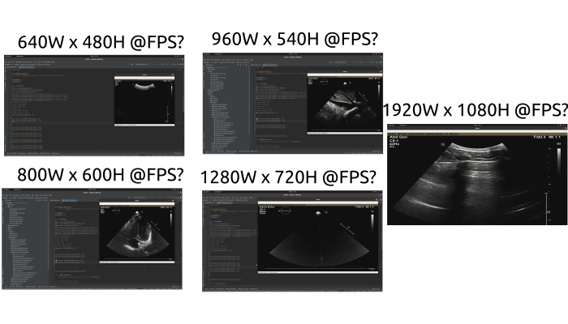

# Hardware test

## Frame-grabber MiraBox Video Capture

## Resolution tests
```
cd $HOME/repositories/echocardiography/scripts/hardware
conda activate rt-ai-echo-VE 
#python framegrabber_capturing_video.py --frame_width 640 --frame_height 480 --frames_per_second 60
#python framegrabber_capturing_video.py --frame_width 800 --frame_height 600 --frames_per_second 60
#python framegrabber_capturing_video.py --frame_width 960 --frame_height 540 --frames_per_second 60
#python framegrabber_capturing_video.py --frame_width 1280 --frame_height 720 --frames_per_second 60
#python framegrabber_capturing_video.py --frame_width 1024 --frame_height 768 --frames_per_second 60
#python framegrabber_capturing_video.py --frame_width 1280 --frame_height 960 --frames_per_second 30 
#python framegrabber_capturing_video.py --frame_width 1280 --frame_height 960 --frames_per_second 60 # DISPLAY BLACK_SCREEN
#python framegrabber_capturing_video.py --frame_width 1920 --frame_height 1080 --frames_per_second 60
```

Terminal logs

``` 
python framegrabber_capturing_video.py --frame_width 1024 --frame_height 768 --frames_per_second 60

fps: 60.0
resolution: 1024.0x768.0
mode: MJPG
Buffer size: 1.0
```

``` 
python framegrabber_capturing_video.py --frame_width 1920 --frame_height 1080 --frames_per_second 60

fps: 60.0
resolution: 1920.0x1080.0
mode: MJPG
Buffer size: 1.0
```


   
See all figures [here](../../figures/framegrabber/)

### $ lsusb
```
Bus 002 Device 004: ID 1bcf:2c99 Sunplus Innovation Technology Inc. MiraBox Video Capture
```

### v4l2-ctl -d /dev/video2 --all
``` 
v4l2-ctl -d /dev/video2 --all
Driver Info:
	Driver name      : uvcvideo
	Card type        : MiraBox Video Capture: MiraBox 
	Bus info         : usb-0000:00:14.0-6
	Driver version   : 5.13.19
	Capabilities     : 0x84a00001
		Video Capture
		Metadata Capture
		Streaming
		Extended Pix Format
		Device Capabilities
	Device Caps      : 0x04200001
		Video Capture
		Streaming
		Extended Pix Format
Priority: 2
Video input : 0 (Camera 1: ok)
Format Video Capture:
	Width/Height      : 1280/960
	Pixel Format      : 'MJPG' (Motion-JPEG)
	Field             : None
	Bytes per Line    : 0
	Size Image        : 2457600
	Colorspace        : sRGB
	Transfer Function : Rec. 709
	YCbCr/HSV Encoding: ITU-R 601
	Quantization      : Default (maps to Full Range)
	Flags             : 
Crop Capability Video Capture:
	Bounds      : Left 0, Top 0, Width 1280, Height 960
	Default     : Left 0, Top 0, Width 1280, Height 960
	Pixel Aspect: 1/1
Selection Video Capture: crop_default, Left 0, Top 0, Width 1280, Height 960, Flags: 
Selection Video Capture: crop_bounds, Left 0, Top 0, Width 1280, Height 960, Flags: 
Streaming Parameters Video Capture:
	Capabilities     : timeperframe
	Frames per second: 60.000 (60/1)
	Read buffers     : 0
                     brightness 0x00980900 (int)    : min=0 max=255 step=1 default=128 value=128
                       contrast 0x00980901 (int)    : min=0 max=255 step=1 default=128 value=128
                     saturation 0x00980902 (int)    : min=0 max=255 step=1 default=128 value=128
                            hue 0x00980903 (int)    : min=-32 max=31 step=1 default=0 value=0

```

### $ dmesg
```
[ 2488.669733] usb 2-5: new SuperSpeed USB device number 5 using xhci_hcd
[ 2488.703998] usb 2-5: New USB device found, idVendor=1bcf, idProduct=2c99, bcdDevice= 2.00
[ 2488.704012] usb 2-5: New USB device strings: Mfr=1, Product=2, SerialNumber=0
[ 2488.704018] usb 2-5: Product: MiraBox Video Capture
[ 2488.704022] usb 2-5: Manufacturer: VXIS Inc
[ 2488.714485] usb 2-5: Found UVC 1.00 device MiraBox Video Capture (1bcf:2c99)
[ 2488.715246] usb 2-5: Failed to query (GET_INFO) UVC control 11 on unit 1: -32 (exp. 1).
[ 2488.718774] usb 2-5: Disable of device-initiated U1 failed.
[ 2488.719407] usb 2-5: Disable of device-initiated U2 failed.
[ 2488.729358] input: MiraBox Video Capture: MiraBox  as /devices/pci0000:00/0000:00:14.0/usb2/2-5/2-5:1.0/input/input35
[ 2488.732214] usb 2-5: Disable of device-initiated U1 failed.
[ 2488.733030] usb 2-5: Disable of device-initiated U2 failed.
[ 2488.737000] usb 2-5: 3:1: cannot get freq at ep 0x86
[ 2488.737764] usb 2-5: Disable of device-initiated U1 failed.
[ 2488.738514] usb 2-5: Disable of device-initiated U2 failed.
[ 2488.741661] usb 2-5: Disable of device-initiated U1 failed.
[ 2488.742214] usb 2-5: Disable of device-initiated U2 failed.
[ 2488.748605] usb 2-5: Warning! Unlikely big volume range (=4096), cval->res is probably wrong.
[ 2488.748617] usb 2-5: [5] FU [Digital In Capture Volume] ch = 1, val = 0/4096/1
```


### $ lsusb -v -d 1bcf:2c99
```
Bus 002 Device 005: ID 1bcf:2c99 Sunplus Innovation Technology Inc. MiraBox Video Capture
Couldn't open device, some information will be missing
Device Descriptor:
  bLength                18
  bDescriptorType         1
  bcdUSB               3.10
  bDeviceClass          239 Miscellaneous Device
  bDeviceSubClass         2 
  bDeviceProtocol         1 Interface Association
  bMaxPacketSize0         9
  idVendor           0x1bcf Sunplus Innovation Technology Inc.
  idProduct          0x2c99 
  bcdDevice            2.00
  iManufacturer           1 
  iProduct                2 
  iSerial                 0 
  bNumConfigurations      1
  Configuration Descriptor:
    bLength                 9
    bDescriptorType         2
    wTotalLength       0x0409
    bNumInterfaces          4
    bConfigurationValue     1
    iConfiguration          0 
    bmAttributes         0x80
      (Bus Powered)
    MaxPower              512mA
    Interface Association:
      bLength                 8
      bDescriptorType        11
      bFirstInterface         0
      bInterfaceCount         2
      bFunctionClass         14 Video
      bFunctionSubClass       3 Video Interface Collection
      bFunctionProtocol       0 
      iFunction               4 
    Interface Descriptor:
      bLength                 9
      bDescriptorType         4
      bInterfaceNumber        0
      bAlternateSetting       0
      bNumEndpoints           1
      bInterfaceClass        14 Video
      bInterfaceSubClass      1 Video Control
      bInterfaceProtocol      0 
      iInterface              4 
      VideoControl Interface Descriptor:
        bLength                13
        bDescriptorType        36
        bDescriptorSubtype      1 (HEADER)
        bcdUVC               1.00
        wTotalLength       0x006d
        dwClockFrequency      125.000000MHz
        bInCollection           1
        baInterfaceNr( 0)       1
      VideoControl Interface Descriptor:
        bLength                18
        bDescriptorType        36
        bDescriptorSubtype      2 (INPUT_TERMINAL)
        bTerminalID             1
        wTerminalType      0x0201 Camera Sensor
        bAssocTerminal          0
        iTerminal               0 
        wObjectiveFocalLengthMin      0
        wObjectiveFocalLengthMax      0
        wOcularFocalLength            0
        bControlSize                  3
        bmControls           0x00000200
          Zoom (Absolute)
      VideoControl Interface Descriptor:
        bLength                11
        bDescriptorType        36
        bDescriptorSubtype      5 (PROCESSING_UNIT)
      Warning: Descriptor too short
        bUnitID                 2
        bSourceID               1
        wMaxMultiplier      16384
        bControlSize            2
        bmControls     0x0000000f
          Brightness
          Contrast
          Hue
          Saturation
        iProcessing             0 
        bmVideoStandards     0x1d
          None
          PAL - 625/50
          SECAM - 625/50
          NTSC - 625/50
      VideoControl Interface Descriptor:
        bLength                29
        bDescriptorType        36
        bDescriptorSubtype      6 (EXTENSION_UNIT)
        bUnitID                 3
        guidExtensionCode         {0fb885c3-68c2-4547-90f7-8f47579d95fc}
        bNumControl            16
        bNrPins                 1
        baSourceID( 0)          2
        bControlSize            4
        bmControls( 0)       0x3f
        bmControls( 1)       0x07
        bmControls( 2)       0x07
        bmControls( 3)       0x0f
        iExtension              0 
      VideoControl Interface Descriptor:
        bLength                29
        bDescriptorType        36
        bDescriptorSubtype      6 (EXTENSION_UNIT)
        bUnitID                 4
        guidExtensionCode         {7d5a1d99-5b32-428b-8cad-671b8a65f37a}
        bNumControl            23
        bNrPins                 1
        baSourceID( 0)          3
        bControlSize            4
        bmControls( 0)       0xff
        bmControls( 1)       0xff
        bmControls( 2)       0xfe
        bmControls( 3)       0x00
        iExtension              0 
      VideoControl Interface Descriptor:
        bLength                 9
        bDescriptorType        36
        bDescriptorSubtype      3 (OUTPUT_TERMINAL)
        bTerminalID             5
        wTerminalType      0x0101 USB Streaming
        bAssocTerminal          0
        bSourceID               4
        iTerminal               0 
      Endpoint Descriptor:
        bLength                 7
        bDescriptorType         5
        bEndpointAddress     0x87  EP 7 IN
        bmAttributes            3
          Transfer Type            Interrupt
          Synch Type               None
          Usage Type               Data
        wMaxPacketSize     0x0010  1x 16 bytes
        bInterval               8
        bMaxBurst               0
    Interface Descriptor:
      bLength                 9
      bDescriptorType         4
      bInterfaceNumber        1
      bAlternateSetting       0
      bNumEndpoints           1
      bInterfaceClass        14 Video
      bInterfaceSubClass      2 Video Streaming
      bInterfaceProtocol      0 
      iInterface              0 
      VideoStreaming Interface Descriptor:
        bLength                            15
        bDescriptorType                    36
        bDescriptorSubtype                  1 (INPUT_HEADER)
        bNumFormats                         2
        wTotalLength                   0x02e9
        bEndPointAddress                  129
        bmInfo                              0
        bTerminalLink                       5
        bStillCaptureMethod                 1
        bTriggerSupport                     0
        bTriggerUsage                       0
        bControlSize                        1
        bmaControls( 0)                     4
        bmaControls( 1)                     0
      VideoStreaming Interface Descriptor:
        bLength                            11
        bDescriptorType                    36
        bDescriptorSubtype                  6 (FORMAT_MJPEG)
        bFormatIndex                        1
        bNumFrameDescriptors               10
        bFlags                              1
          Fixed-size samples: Yes
        bDefaultFrameIndex                  1
        bAspectRatioX                       0
        bAspectRatioY                       0
        bmInterlaceFlags                 0x00
          Interlaced stream or variable: No
          Fields per frame: 1 fields
          Field 1 first: No
          Field pattern: Field 1 only
        bCopyProtect                        0
      VideoStreaming Interface Descriptor:
        bLength                            34
        bDescriptorType                    36
        bDescriptorSubtype                  7 (FRAME_MJPEG)
        bFrameIndex                         1
        bmCapabilities                   0x01
          Still image supported
        wWidth                           1920
        wHeight                          1080
        dwMinBitRate                995328000
        dwMaxBitRate                1990656000
        dwMaxVideoFrameBufferSize     4147200
        dwDefaultFrameInterval         333333
        bFrameIntervalType                  2
        dwFrameInterval( 0)            166666
        dwFrameInterval( 1)            333333
      VideoStreaming Interface Descriptor:
        bLength                            34
        bDescriptorType                    36
        bDescriptorSubtype                  7 (FRAME_MJPEG)
        bFrameIndex                         2
        bmCapabilities                   0x01
          Still image supported
        wWidth                            640
        wHeight                           480
        dwMinBitRate                147456000
        dwMaxBitRate                294912000
        dwMaxVideoFrameBufferSize      614400
        dwDefaultFrameInterval         333333
        bFrameIntervalType                  2
        dwFrameInterval( 0)            166666
        dwFrameInterval( 1)            333333
      VideoStreaming Interface Descriptor:
        bLength                            34
        bDescriptorType                    36
        bDescriptorSubtype                  7 (FRAME_MJPEG)
        bFrameIndex                         3
        bmCapabilities                   0x01
          Still image supported
        wWidth                            800
        wHeight                           600
        dwMinBitRate                230400000
        dwMaxBitRate                460800000
        dwMaxVideoFrameBufferSize      960000
        dwDefaultFrameInterval         333333
        bFrameIntervalType                  2
        dwFrameInterval( 0)            166666
        dwFrameInterval( 1)            333333
      VideoStreaming Interface Descriptor:
        bLength                            34
        bDescriptorType                    36
        bDescriptorSubtype                  7 (FRAME_MJPEG)
        bFrameIndex                         4
        bmCapabilities                   0x01
          Still image supported
        wWidth                           1024
        wHeight                           768
        dwMinBitRate                377487360
        dwMaxBitRate                754974720
        dwMaxVideoFrameBufferSize     1572864
        dwDefaultFrameInterval         333333
        bFrameIntervalType                  2
        dwFrameInterval( 0)            166666
        dwFrameInterval( 1)            333333
      VideoStreaming Interface Descriptor:
        bLength                            34
        bDescriptorType                    36
        bDescriptorSubtype                  7 (FRAME_MJPEG)
        bFrameIndex                         5
        bmCapabilities                   0x01
          Still image supported
        wWidth                           1280
        wHeight                           720
        dwMinBitRate                442368000
        dwMaxBitRate                884736000
        dwMaxVideoFrameBufferSize     1843200
        dwDefaultFrameInterval         333333
        bFrameIntervalType                  2
        dwFrameInterval( 0)            166666
        dwFrameInterval( 1)            333333
      VideoStreaming Interface Descriptor:
        bLength                            34
        bDescriptorType                    36
        bDescriptorSubtype                  7 (FRAME_MJPEG)
        bFrameIndex                         6
        bmCapabilities                   0x01
          Still image supported
        wWidth                           1280
        wHeight                           960
        dwMinBitRate                589824000
        dwMaxBitRate                1179648000
        dwMaxVideoFrameBufferSize     2457600
        dwDefaultFrameInterval         333333
        bFrameIntervalType                  2
        dwFrameInterval( 0)            166666
        dwFrameInterval( 1)            333333
      VideoStreaming Interface Descriptor:
        bLength                            34
        bDescriptorType                    36
        bDescriptorSubtype                  7 (FRAME_MJPEG)
        bFrameIndex                         7
        bmCapabilities                   0x01
          Still image supported
        wWidth                           1280
        wHeight                          1024
        dwMinBitRate                629145600
        dwMaxBitRate                1258291200
        dwMaxVideoFrameBufferSize     2621440
        dwDefaultFrameInterval         333333
        bFrameIntervalType                  2
        dwFrameInterval( 0)            166666
        dwFrameInterval( 1)            333333
      VideoStreaming Interface Descriptor:
        bLength                            34
        bDescriptorType                    36
        bDescriptorSubtype                  7 (FRAME_MJPEG)
        bFrameIndex                         8
        bmCapabilities                   0x01
          Still image supported
        wWidth                           1360
        wHeight                           768
        dwMinBitRate                501350400
        dwMaxBitRate                1002700800
        dwMaxVideoFrameBufferSize     2088960
        dwDefaultFrameInterval         333333
        bFrameIntervalType                  2
        dwFrameInterval( 0)            166666
        dwFrameInterval( 1)            333333
      VideoStreaming Interface Descriptor:
        bLength                            34
        bDescriptorType                    36
        bDescriptorSubtype                  7 (FRAME_MJPEG)
        bFrameIndex                         9
        bmCapabilities                   0x01
          Still image supported
        wWidth                           1400
        wHeight                           900
        dwMinBitRate                604800000
        dwMaxBitRate                1209600000
        dwMaxVideoFrameBufferSize     2520000
        dwDefaultFrameInterval         333333
        bFrameIntervalType                  2
        dwFrameInterval( 0)            166666
        dwFrameInterval( 1)            333333
      VideoStreaming Interface Descriptor:
        bLength                            34
        bDescriptorType                    36
        bDescriptorSubtype                  7 (FRAME_MJPEG)
        bFrameIndex                        10
        bmCapabilities                   0x01
          Still image supported
        wWidth                           1440
        wHeight                           900
        dwMinBitRate                622080000
        dwMaxBitRate                1244160000
        dwMaxVideoFrameBufferSize     2592000
        dwDefaultFrameInterval         333333
        bFrameIntervalType                  2
        dwFrameInterval( 0)            166666
        dwFrameInterval( 1)            333333
      VideoStreaming Interface Descriptor:
        bLength                             6
        bDescriptorType                    36
        bDescriptorSubtype                 13 (COLORFORMAT)
        bColorPrimaries                     1 (BT.709,sRGB)
        bTransferCharacteristics            1 (BT.709)
        bMatrixCoefficients                 4 (SMPTE 170M (BT.601))
      VideoStreaming Interface Descriptor:
        bLength                            27
        bDescriptorType                    36
        bDescriptorSubtype                  4 (FORMAT_UNCOMPRESSED)
        bFormatIndex                        2
        bNumFrameDescriptors               10
        guidFormat                            {32595559-0000-0010-8000-00aa00389b71}
        bBitsPerPixel                      16
        bDefaultFrameIndex                  1
        bAspectRatioX                       0
        bAspectRatioY                       0
        bmInterlaceFlags                 0x00
          Interlaced stream or variable: No
          Fields per frame: 2 fields
          Field 1 first: No
          Field pattern: Field 1 only
        bCopyProtect                        0
      VideoStreaming Interface Descriptor:
        bLength                            34
        bDescriptorType                    36
        bDescriptorSubtype                  5 (FRAME_UNCOMPRESSED)
        bFrameIndex                         1
        bmCapabilities                   0x01
          Still image supported
        wWidth                           1920
        wHeight                          1080
        dwMinBitRate                995328000
        dwMaxBitRate                1990656000
        dwMaxVideoFrameBufferSize     4147200
        dwDefaultFrameInterval         333333
        bFrameIntervalType                  2
        dwFrameInterval( 0)            166666
        dwFrameInterval( 1)            333333
      VideoStreaming Interface Descriptor:
        bLength                            34
        bDescriptorType                    36
        bDescriptorSubtype                  5 (FRAME_UNCOMPRESSED)
        bFrameIndex                         2
        bmCapabilities                   0x01
          Still image supported
        wWidth                            640
        wHeight                           480
        dwMinBitRate                147456000
        dwMaxBitRate                294912000
        dwMaxVideoFrameBufferSize      614400
        dwDefaultFrameInterval         333333
        bFrameIntervalType                  2
        dwFrameInterval( 0)            166666
        dwFrameInterval( 1)            333333
      VideoStreaming Interface Descriptor:
        bLength                            34
        bDescriptorType                    36
        bDescriptorSubtype                  5 (FRAME_UNCOMPRESSED)
        bFrameIndex                         3
        bmCapabilities                   0x01
          Still image supported
        wWidth                            800
        wHeight                           600
        dwMinBitRate                230400000
        dwMaxBitRate                460800000
        dwMaxVideoFrameBufferSize      960000
        dwDefaultFrameInterval         333333
        bFrameIntervalType                  2
        dwFrameInterval( 0)            166666
        dwFrameInterval( 1)            333333
      VideoStreaming Interface Descriptor:
        bLength                            34
        bDescriptorType                    36
        bDescriptorSubtype                  5 (FRAME_UNCOMPRESSED)
        bFrameIndex                         4
        bmCapabilities                   0x01
          Still image supported
        wWidth                           1024
        wHeight                           768
        dwMinBitRate                377487360
        dwMaxBitRate                754974720
        dwMaxVideoFrameBufferSize     1572864
        dwDefaultFrameInterval         333333
        bFrameIntervalType                  2
        dwFrameInterval( 0)            166666
        dwFrameInterval( 1)            333333
      VideoStreaming Interface Descriptor:
        bLength                            34
        bDescriptorType                    36
        bDescriptorSubtype                  5 (FRAME_UNCOMPRESSED)
        bFrameIndex                         5
        bmCapabilities                   0x01
          Still image supported
        wWidth                           1280
        wHeight                           720
        dwMinBitRate                442368000
        dwMaxBitRate                884736000
        dwMaxVideoFrameBufferSize     1843200
        dwDefaultFrameInterval         333333
        bFrameIntervalType                  2
        dwFrameInterval( 0)            166666
        dwFrameInterval( 1)            333333
      VideoStreaming Interface Descriptor:
        bLength                            34
        bDescriptorType                    36
        bDescriptorSubtype                  5 (FRAME_UNCOMPRESSED)
        bFrameIndex                         6
        bmCapabilities                   0x01
          Still image supported
        wWidth                           1280
        wHeight                           960
        dwMinBitRate                589824000
        dwMaxBitRate                1179648000
        dwMaxVideoFrameBufferSize     2457600
        dwDefaultFrameInterval         333333
        bFrameIntervalType                  2
        dwFrameInterval( 0)            166666
        dwFrameInterval( 1)            333333
      VideoStreaming Interface Descriptor:
        bLength                            34
        bDescriptorType                    36
        bDescriptorSubtype                  5 (FRAME_UNCOMPRESSED)
        bFrameIndex                         7
        bmCapabilities                   0x01
          Still image supported
        wWidth                           1280
        wHeight                          1024
        dwMinBitRate                629145600
        dwMaxBitRate                1258291200
        dwMaxVideoFrameBufferSize     2621440
        dwDefaultFrameInterval         333333
        bFrameIntervalType                  2
        dwFrameInterval( 0)            166666
        dwFrameInterval( 1)            333333
      VideoStreaming Interface Descriptor:
        bLength                            34
        bDescriptorType                    36
        bDescriptorSubtype                  5 (FRAME_UNCOMPRESSED)
        bFrameIndex                         8
        bmCapabilities                   0x01
          Still image supported
        wWidth                           1360
        wHeight                           768
        dwMinBitRate                501350400
        dwMaxBitRate                1002700800
        dwMaxVideoFrameBufferSize     2088960
        dwDefaultFrameInterval         333333
        bFrameIntervalType                  2
        dwFrameInterval( 0)            166666
        dwFrameInterval( 1)            333333
      VideoStreaming Interface Descriptor:
        bLength                            34
        bDescriptorType                    36
        bDescriptorSubtype                  5 (FRAME_UNCOMPRESSED)
        bFrameIndex                         9
        bmCapabilities                   0x01
          Still image supported
        wWidth                           1400
        wHeight                           900
        dwMinBitRate                604800000
        dwMaxBitRate                1209600000
        dwMaxVideoFrameBufferSize     2520000
        dwDefaultFrameInterval         333333
        bFrameIntervalType                  2
        dwFrameInterval( 0)            166666
        dwFrameInterval( 1)            333333
      VideoStreaming Interface Descriptor:
        bLength                            34
        bDescriptorType                    36
        bDescriptorSubtype                  5 (FRAME_UNCOMPRESSED)
        bFrameIndex                        10
        bmCapabilities                   0x01
          Still image supported
        wWidth                           1440
        wHeight                           900
        dwMinBitRate                622080000
        dwMaxBitRate                1244160000
        dwMaxVideoFrameBufferSize     2592000
        dwDefaultFrameInterval         333333
        bFrameIntervalType                  2
        dwFrameInterval( 0)            166666
        dwFrameInterval( 1)            333333
      VideoStreaming Interface Descriptor:
        bLength                             6
        bDescriptorType                    36
        bDescriptorSubtype                 13 (COLORFORMAT)
        bColorPrimaries                     1 (BT.709,sRGB)
        bTransferCharacteristics            1 (BT.709)
        bMatrixCoefficients                 4 (SMPTE 170M (BT.601))
      Endpoint Descriptor:
        bLength                 7
        bDescriptorType         5
        bEndpointAddress     0x81  EP 1 IN
        bmAttributes            2
          Transfer Type            Bulk
          Synch Type               None
          Usage Type               Data
        wMaxPacketSize     0x0400  1x 1024 bytes
        bInterval               0
        bMaxBurst              15
    Interface Association:
      bLength                 8
      bDescriptorType        11
      bFirstInterface         2
      bInterfaceCount         2
      bFunctionClass          1 Audio
      bFunctionSubClass       2 Streaming
      bFunctionProtocol       0 
      iFunction               0 
    Interface Descriptor:
      bLength                 9
      bDescriptorType         4
      bInterfaceNumber        2
      bAlternateSetting       0
      bNumEndpoints           0
      bInterfaceClass         1 Audio
      bInterfaceSubClass      1 Control Device
      bInterfaceProtocol      0 
      iInterface              0 
      AudioControl Interface Descriptor:
        bLength                 9
        bDescriptorType        36
        bDescriptorSubtype      1 (HEADER)
        bcdADC               1.00
        wTotalLength       0x0026
        bInCollection           1
        baInterfaceNr(0)        3
      AudioControl Interface Descriptor:
        bLength                12
        bDescriptorType        36
        bDescriptorSubtype      2 (INPUT_TERMINAL)
        bTerminalID             1
        wTerminalType      0x0602 Digital Audio Interface
        bAssocTerminal          0
        bNrChannels             2
        wChannelConfig     0x0003
          Left Front (L)
          Right Front (R)
        iChannelNames           0 
        iTerminal               0 
      AudioControl Interface Descriptor:
        bLength                 9
        bDescriptorType        36
        bDescriptorSubtype      3 (OUTPUT_TERMINAL)
        bTerminalID             3
        wTerminalType      0x0101 USB Streaming
        bAssocTerminal          0
        bSourceID               5
        iTerminal               0 
      AudioControl Interface Descriptor:
        bLength                 8
        bDescriptorType        36
        bDescriptorSubtype      6 (FEATURE_UNIT)
        bUnitID                 5
        bSourceID               1
        bControlSize            1
        bmaControls(0)       0x03
          Mute Control
          Volume Control
        iFeature                0 
    Interface Descriptor:
      bLength                 9
      bDescriptorType         4
      bInterfaceNumber        3
      bAlternateSetting       0
      bNumEndpoints           0
      bInterfaceClass         1 Audio
      bInterfaceSubClass      2 Streaming
      bInterfaceProtocol      0 
      iInterface              0 
    Interface Descriptor:
      bLength                 9
      bDescriptorType         4
      bInterfaceNumber        3
      bAlternateSetting       1
      bNumEndpoints           1
      bInterfaceClass         1 Audio
      bInterfaceSubClass      2 Streaming
      bInterfaceProtocol      0 
      iInterface              0 
      AudioStreaming Interface Descriptor:
        bLength                 7
        bDescriptorType        36
        bDescriptorSubtype      1 (AS_GENERAL)
        bTerminalLink           3
        bDelay                  1 frames
        wFormatTag         0x0001 PCM
      AudioStreaming Interface Descriptor:
        bLength                11
        bDescriptorType        36
        bDescriptorSubtype      2 (FORMAT_TYPE)
        bFormatType             1 (FORMAT_TYPE_I)
        bNrChannels             2
        bSubframeSize           2
        bBitResolution         16
        bSamFreqType            1 Discrete
        tSamFreq[ 0]        48000
      Endpoint Descriptor:
        bLength                 9
        bDescriptorType         5
        bEndpointAddress     0x86  EP 6 IN
        bmAttributes            5
          Transfer Type            Isochronous
          Synch Type               Asynchronous
          Usage Type               Data
        wMaxPacketSize     0x00c4  1x 196 bytes
        bInterval               4
        bRefresh                0
        bSynchAddress           0
        bMaxBurst               0
        AudioStreaming Endpoint Descriptor:
          bLength                 7
          bDescriptorType        37
          bDescriptorSubtype      1 (EP_GENERAL)
          bmAttributes         0x01
            Sampling Frequency
          bLockDelayUnits         0 Undefined
          wLockDelay         0x0000
```


## References
https://github.com/gomezalberto/pretus/blob/main/src/Plugins/Plugin_PnPframegrabber/capture_video.py  
https://gist.github.com/aziraphale/f40044af69c5e001b296242fccbd33e3       
https://linux-hardware.org/index.php?id=usb:1bcf-2c99