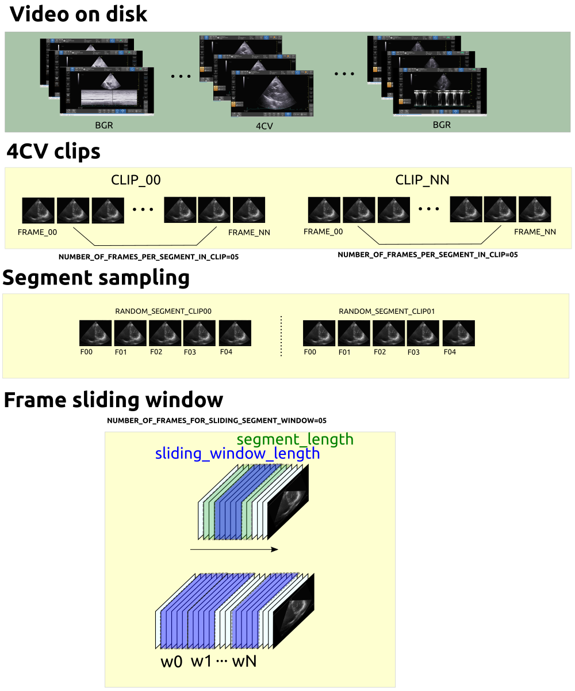

# Learning pipeline
Following the [Good Machine Learning Practices](https://www.fda.gov/media/122535/download), the learning pipeline for the echochardiography datasets will be based in the following elements: 
1. Data-selection and management
2. Model training and tuning
3 .Model validation (performance evaluation and clinical evaluation)

## Generate list txt files for train / validate sets

### [split_train_validate_test.py](split_train_validate_test.py)
Open a terminal and load your conda environment 
```
cd $HOME/repositories/echocardiography/scripts/learning-pipeline
export PYTHONPATH=$HOME/repositories/echocardiography/ #set PYTHONPATH environment variable
conda activate rt-ai-echo-VE
python split_train_validate_test.py --config ../config_files/data_lists/config_echodatasets_split.yml 
```
Edit [config_echodatasets_split.yml](../config_files/data_lists/config_echodatasets_split.yml) with the right paths and percentage of `ntraining`:  
```
user_path: &HOME_DIR /home/mx19
echodataset_path: !join [*HOME_DIR, /datasets/vital-us/echocardiography/videos-echo-test]
data_list_output_path: !join [*HOME_DIR, /repositories/echocardiography/scripts/config_files/data_lists/]
ntraining: 0.5
```
Then, text files looks like as follows:
```
../config_files/data_lists/annotation_list_full.txt
../config_files/data_lists/annotation_list_train.txt
../config_files/data_lists/video_list_full.txt
../config_files/data_lists/video_list_train.txt
```

## Scripts 
### [learning_pipeline.py](learning_pipeline.py) and [learning_pipeline_notebook.ipynb](learning_pipeline_notebook.ipynb)
Open a terminal and load your conda environment 
```
cd $HOME/repositories/echocardiography/scripts/learning-pipeline
export PYTHONPATH=$HOME/repositories/echocardiography/ #set PYTHONPATH environment variable
conda activate rt-ai-echo-VE
python learning_pipeline.py --config ../config_files/learning_pipeline/config_learning_pipeline.yml 
# Alternavively with the use of jupyter notebook
jupyter notebook
```

Description when using echo_classes.py
* 'participant 072 with T1-01clips; T2-03clips; T3-02clips' with`echo_classes.py` generates 12 clips
* 'participant 074 - T1-02clips; T2-02clips; T3-00clips' with `echo_classes.py` generates 8 clips
  * 'participant 072 with T1-01clips;' with `echo_classes.py` generate 2 clips 
  * 'participant 072 with T2-03clips;' with `echo_classes.py` generate 6 clips
  * 'participant 072 with T3-02clips;' with `echo_classes.py` generate 4 clips

### dataloader_4CV.py
Open a terminal and load your conda environment 
```
cd $HOME/repositories/echocardiography/scripts/dataloaders
export PYTHONPATH=$HOME/repositories/echocardiography/ #set PYTHONPATH environment variable
conda activate rt-ai-echo-VE 
python dataloader_4CV.py --config ../config_files/config_4cv.yml
```
The following figure illustrate the pipeline to create classes for background and 4CH; segments of random clips; segment sampling and frame sliding window techniques.


### Setting config file 
For datapaths of other users, you can edit ../config_files/config_4cv.yml and add respective participant video path and json files path. 
``` 
### Datapaths
#### 01NVb-003-072
participant_videos_path: '/home/mx19/datasets/vital-us/echocardiography/videos-echo/01NVb-003-072'
participant_path_json_files: '/home/mx19/datasets/vital-us/echocardiography/json/01NVb-003-072'
```

### Jupyter Notebooks
Open a terminal and load your conda environment 
```
cd $HOME/repositories/echocardiography/scripts/dataloaders
export PYTHONPATH=$HOME/repositories/echocardiography/ #set PYTHONPATH environment variable
conda activate rt-ai-echo-VE 
jupyter notebook
```


