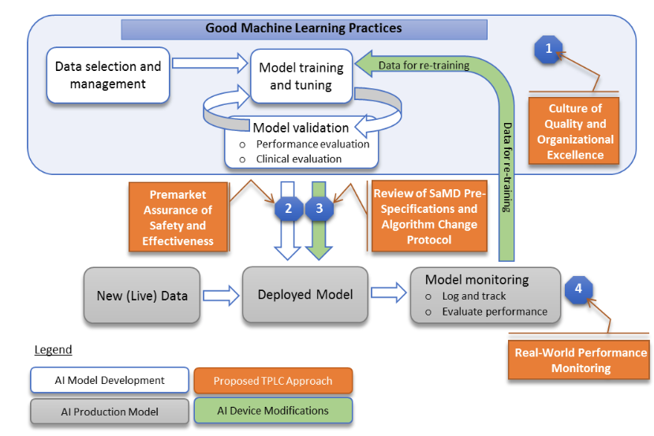

# Learning pipeline
## Introduction 
The learning pipeline for the echochardiography datasets is based in the following elements: 
Data-selection and management; Model training and tuning; Model validation (performance evaluation and clinical evaluation); AI-based device modification, and (perhaps) AI-based production model (Figure 1).   
   
_Fig 1. Total product lifecycle (TPLC) approach on AI/ML workflow from [Good Machine Learning Practices](https://www.fda.gov/media/122535/download)_

## 1. Setting up your datasets and labels
Prepare your mp4 files and annotations files as suggested [here](../curation-and-selection). 
It is suggested that files have following organisation and localisation.
**NOTE**. extra video files can be renamed with a different extension to avoid taking them into account.

<details>
  <summary>Click to expand and see files organisation and location! </summary>
  
```
cd $HOME/datasets/vital-us/echocardiography/videos-echo-annotated
 tree -s
.
├── [       4096]  01NVb-003-060
│   ├── [       4096]  T1
│   │   ├── [        904]  01NVb-003-060-1-4CV.json
│   │   └── [  925627181]  01NVb-003-060-1 echo.mp4
│   ├── [       4096]  T2
│   │   └── [       4096]  extras
│   │       ├── [  197737394]  01NVb-003-060-2 echo cont_mp4_
│   │       └── [ 2100486583]  01NVb-003-060-2 echo_mp4_
│   └── [       4096]  T3
├── [       4096]  01NVb-003-061
│   ├── [       4096]  T1
│   ├── [       4096]  T2
│   └── [       4096]  T3
│       ├── [        904]  01NVb-003-061-3-4CV.json
│       └── [ 1536436836]  01NVb-003-061-3 echo.mp4
├── [       4096]  01NVb-003-063
│   ├── [       4096]  T1
│   │   ├── [        988]  01NVb-003-063-1-4CV.json
│   │   └── [ 1224566105]  01NVb-003-063-1 echo.mp4
│   ├── [       4096]  T2
│   │   ├── [        986]  01NVb-003-063-2-4CV.json
│   │   └── [ 2099290213]  01NVb-003-063-2 echo.mp4
│   └── [       4096]  T3
│       ├── [        904]  01NVb-003-063-3-4CV.json
│       └── [  745764679]  01NVb-003-063-3 echo.mp4
├── [       4096]  01NVb-003-064
│   ├── [       4096]  T1
│   │   ├── [        990]  01NVb-003-064-1-4CV.json
│   │   └── [  873630172]  01NVb-003-064-1 echo.mp4
│   ├── [       4096]  T2
│   │   ├── [       1072]  01NVb-003-064-2-4CV.json
│   │   └── [ 2011565463]  01NVb-003-064-2 echo.mp4
│   └── [       4096]  T3
├── [       4096]  01NVb-003-065
│   ├── [       4096]  T1
│   │   ├── [       1074]  01NVb-003-065-1-4CV.json
│   │   └── [  843344200]  01NVb-003-065-1 echo.mp4
│   ├── [       4096]  T2
│   │   ├── [       1153]  01NVb-003-065-2-4CV.json
│   │   └── [  898836427]  01NVb-003-065-2 echo.mp4
│   └── [       4096]  T3
│       ├── [       1239]  01NVb-003-065-3-4CV.json
│       └── [  980305284]  01NVb-003-065-3 echo.mp4
├── [       4096]  01NVb-003-066
│   ├── [       4096]  T1
│   │   ├── [        906]  01NVb-003-066-1-4CV.json
│   │   └── [  963141960]  01NVb-003-066-1 echo.mp4
│   ├── [       4096]  T2
│   │   ├── [        990]  01NVb-003-066-2-4CV.json
│   │   └── [  705532801]  01NVb-003-066-2 echo.mp4
│   └── [       4096]  T3
├── [       4096]  01NVb-003-067
│   ├── [       4096]  T1
│   ├── [       4096]  T2
│   └── [       4096]  T3
├── [       4096]  01NVb-003-068
│   ├── [       4096]  T1
│   │   ├── [        990]  01NVb-003-068-1-4CV.json
│   │   └── [ 1007127711]  01NVb-003-068-1 echo.mp4
│   ├── [       4096]  T2
│   └── [       4096]  T3
│       ├── [        998]  01NVb-003-068-3-4CV.json
│       └── [ 1104881573]  01NVb-003-068-3 echo.mp4
└── [       4096]  01NVb-003-069
    ├── [       4096]  T1
    │   ├── [        987]  01NVb-003-069-1-4CV.json
    │   └── [ 1358342013]  01NVb-003-069-1 echo.mp4
    ├── [       4096]  T2
    │   ├── [        987]  01NVb-003-069-2-4CV.json
    │   └── [ 1783210718]  01NVb-003-069-2 echo.mp4
    └── [       4096]  T3
        ├── [        988]  01NVb-003-069-3-4CV.json
        └── [ 1178134931]  01NVb-003-069-3 echo.mp4

37 directories, 36 files
```
</details>


## 2. Learning pipeline scripts 
### [learning_pipeline_notebook.ipynb](learning_pipeline_notebook.ipynb)
* Open a terminal, load your conda environment and run the script.
```
cd $HOME/repositories/echocardiography/scripts/learning-pipeline
export PYTHONPATH=$HOME/repositories/echocardiography/ #set PYTHONPATH environment variable
conda activate rt-ai-echo-VE 
jupyter notebook # to open *.ipynb in your web-browser
```
**NOTE**. You might like to delete previous frames at `$HOME/tmp/echoviddata_{K}frames` where K are the `number_of_frames_per_segment_in_a_clip`.

* Description when using echo_classes.py
``` 
* 'participant 072 with T1-01clips; T2-03clips; T3-02clips' with`echo_classes.py` generates 12 clips
* 'participant 074 - T1-02clips; T2-02clips; T3-00clips' with `echo_classes.py` generates 8 clips
* 'participant 072 with T1-01clips;' with `echo_classes.py` generate 2 clips 
* 'participant 072 with T2-03clips;' with `echo_classes.py` generate 6 clips
* 'participant 072 with T3-02clips;' with `echo_classes.py` generate 4 clips
```

* Temporal files 
`EchoClassesDataset()` creates a temporal tamp at `$HOME/tmp/echoviddata_{K}frames` where K are the `number_of_frames_per_segment_in_a_clip`.  
Example:
```
mx19@sie133-lap:~/tmp/echoviddata_10frames$ ll
total 269M
10133820 drwxrwxr-x 2 mx19 mx19 4.0K Feb  9 12:25 .
10133817 drwxrwxr-x 3 mx19 mx19 4.0K Feb  9 12:25 ..
10094468 -rw-rw-r-- 1 mx19 mx19 9.4M Feb  9 12:25 videoID_0_label_0_train.pth
10101267 -rw-rw-r-- 1 mx19 mx19 5.2M Feb  9 12:25 videoID_10_label_0_train.pth
10101269 -rw-rw-r-- 1 mx19 mx19 9.4M Feb  9 12:25 videoID_11_label_0_train.pth
10101278 -rw-rw-r-- 1 mx19 mx19 9.5M Feb  9 12:25 videoID_12_label_0_train.pth
```

### Echochardiography classes
The following figure illustrate the pipeline to create classes for background and 4CH; segments of random clips; segment sampling and frame sliding window techniques.
  
_Fig 2. Description of clips, videos and classes for 4CV_