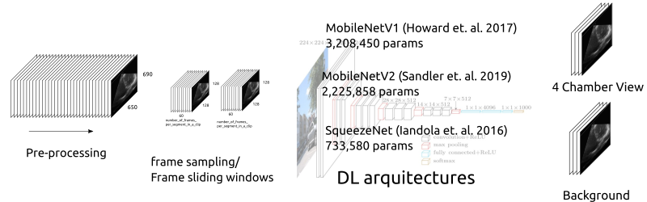

# Learning pipeline
## Introduction 
The learning pipeline for the echochardiography datasets is based in the following elements: 
Data-selection and management; Model training and tuning; Model validation (performance evaluation and clinical evaluation); AI-based device modification, and (perhaps) AI-based production model (Fig. 1).   
   
_Fig 1. Total product lifecycle (TPLC) approach on AI/ML workflow from [Good Machine Learning Practices](https://www.fda.gov/media/122535/download)_

## 1. Setting up your datasets and labels
Prepare your mp4 files and annotations files as suggested [here](../curation-selection-validation). 
It is suggested that files follow this organisation and localisation.
**NOTE**. extra video files can be renamed with a different extension to avoid taking them into account.

<details>
  <summary>Click to expand and see files organisation and location! </summary>
  
```

$ cd /media/mx19/vitaluskcl/datasets/echocardiography/videos-echo-annotated-ALL
$ tree -s
.
├── [       4096]  01NVb-003-050
│   ├── [       4096]  T1
│   │   ├── [        986]  01NVb-003-050-1-4CV.json
│   │   └── [ 1803334463]  01NVb-003-050-1 echo.mp4
│   ├── [       4096]  T2
│   │   ├── [        988]  01NVb-003-050-2-4CV.json
│   │   └── [ 1752445210]  01NVb-003-050-2 echo.mp4
│   └── [       4096]  T3
│       ├── [        987]  01NVb-003-050-3-4CV.json
│       └── [ 1062609410]  01NVb-003-050-3 echo.mp4
├── [       4096]  01NVb-003-051
│   ├── [       4096]  T1
│   │   ├── [        986]  01NVb-003-051-1-4CV.json
│   │   └── [  826247505]  01NVb-003-051-1 echo.mp4
│   ├── [       4096]  T2
│   │   ├── [        988]  01NVb-003-051-2-4CV.json
│   │   └── [ 1234164657]  01NVb-003-051-2 echo.mp4
│   └── [       4096]  T3
│       ├── [        906]  01NVb-003-051-3-4CV.json
│       └── [ 1198707159]  01NVb-003-051-3 echo.mp4
├── [       4096]  01NVb-003-054
│   ├── [       4096]  T1
│   │   ├── [        988]  01NVb-003-054-1-4CV.json
│   │   └── [  999313763]  01NVb-003-054-1 echo.mp4
│   ├── [       4096]  T2
│   └── [       4096]  T3
│       ├── [        987]  01NVb-003-054-3-4CV.json
│       └── [  948032732]  01NVb-003-054-3 echo.mp4
├── [       4096]  01NVb-003-055
│   ├── [       4096]  T1
│   ├── [       4096]  T2
│   └── [       4096]  T3
├── [       4096]  01NVb-003-056
│   ├── [       4096]  T1
│   ├── [       4096]  T2
│   │   ├── [        905]  01NVb-003-056-2-4CV.json
│   │   ├── [  278549244]  01NVb-003-056-2 echo cont_mp4_
│   │   └── [ 2101040630]  01NVb-003-056-2 echo.mp4
│   └── [       4096]  T3
│       ├── [        906]  01NVb-003-056-3-4CV.json
│       ├── [  370831920]  01NVb-003-056-3 echo cont_mp4_
│       └── [ 2101400984]  01NVb-003-056-3 echo.mp4
├── [       4096]  01NVb-003-057
│   ├── [       4096]  T1
│   ├── [       4096]  T2
│   │   ├── [        908]  01NVb-003-057-2-4CV.json
│   │   └── [ 2097924623]  01NVb-003-057-2 echo.mp4
│   └── [       4096]  T3
│       ├── [        994]  01NVb-003-057-3-4CV.json
│       └── [ 1488090627]  01NVb-003-057-3 echo.mp4
├── [       4096]  01NVb-003-058
│   ├── [       4096]  T1
│   │   ├── [        904]  01NVb-003-058-1-4CV.json
│   │   └── [ 1903280524]  01NVb-003-058-1 echo.mp4
│   ├── [       4096]  T2
│   │   ├── [        986]  01NVb-003-058-2-4CV.json
│   │   └── [ 1093631405]  01NVb-003-058-2 echo.mp4
│   └── [       4096]  T3
│       ├── [       1068]  01NVb-003-058-3-4CV.json
│       └── [  928612373]  01NVb-003-058-3 echo.mp4
├── [       4096]  01NVb-003-059
│   ├── [       4096]  T1
│   ├── [       4096]  T2
│   └── [       4096]  T3
├── [       4096]  01NVb-003-060
│   ├── [       4096]  T1
│   │   ├── [        904]  01NVb-003-060-1-4CV.json
│   │   └── [  925627181]  01NVb-003-060-1 echo.mp4
│   ├── [       4096]  T2
│   │   └── [       4096]  extras
│   │       ├── [  197737394]  01NVb-003-060-2 echo cont_mp4_
│   │       └── [ 2100486583]  01NVb-003-060-2 echo_mp4_
│   └── [       4096]  T3
├── [       4096]  01NVb-003-061
│   ├── [       4096]  T1
│   ├── [       4096]  T2
│   └── [       4096]  T3
│       ├── [        904]  01NVb-003-061-3-4CV.json
│       └── [ 1536436836]  01NVb-003-061-3 echo.mp4
├── [       4096]  01NVb-003-063
│   ├── [       4096]  T1
│   │   ├── [        988]  01NVb-003-063-1-4CV.json
│   │   └── [ 1224566105]  01NVb-003-063-1 echo.mp4
│   ├── [       4096]  T2
│   │   ├── [        986]  01NVb-003-063-2-4CV.json
│   │   └── [ 2099290213]  01NVb-003-063-2 echo.mp4
│   └── [       4096]  T3
│       ├── [        904]  01NVb-003-063-3-4CV.json
│       └── [  745764679]  01NVb-003-063-3 echo.mp4
├── [       4096]  01NVb-003-064
│   ├── [       4096]  T1
│   │   ├── [        990]  01NVb-003-064-1-4CV.json
│   │   └── [  873630172]  01NVb-003-064-1 echo.mp4
│   ├── [       4096]  T2
│   │   ├── [       1072]  01NVb-003-064-2-4CV.json
│   │   └── [ 2011565463]  01NVb-003-064-2 echo.mp4
│   └── [       4096]  T3
├── [       4096]  01NVb-003-065
│   ├── [       4096]  T1
│   │   ├── [       1074]  01NVb-003-065-1-4CV.json
│   │   └── [  843344200]  01NVb-003-065-1 echo.mp4
│   ├── [       4096]  T2
│   │   ├── [       1153]  01NVb-003-065-2-4CV.json
│   │   └── [  898836427]  01NVb-003-065-2 echo.mp4
│   └── [       4096]  T3
│       ├── [       1239]  01NVb-003-065-3-4CV.json
│       └── [  980305284]  01NVb-003-065-3 echo.mp4
├── [       4096]  01NVb-003-066
│   ├── [       4096]  T1
│   │   ├── [        906]  01NVb-003-066-1-4CV.json
│   │   └── [  963141960]  01NVb-003-066-1 echo.mp4
│   ├── [       4096]  T2
│   │   ├── [        990]  01NVb-003-066-2-4CV.json
│   │   └── [  705532801]  01NVb-003-066-2 echo.mp4
│   └── [       4096]  T3
├── [       4096]  01NVb-003-067
│   ├── [       4096]  T1
│   ├── [       4096]  T2
│   └── [       4096]  T3
├── [       4096]  01NVb-003-068
│   ├── [       4096]  T1
│   │   ├── [        990]  01NVb-003-068-1-4CV.json
│   │   └── [ 1007127711]  01NVb-003-068-1 echo.mp4
│   ├── [       4096]  T2
│   └── [       4096]  T3
│       ├── [        998]  01NVb-003-068-3-4CV.json
│       └── [ 1104881573]  01NVb-003-068-3 echo.mp4
├── [       4096]  01NVb-003-069
│   ├── [       4096]  T1
│   │   ├── [        987]  01NVb-003-069-1-4CV.json
│   │   └── [ 1358342013]  01NVb-003-069-1 echo.mp4
│   ├── [       4096]  T2
│   │   ├── [        987]  01NVb-003-069-2-4CV.json
│   │   └── [ 1783210718]  01NVb-003-069-2 echo.mp4
│   └── [       4096]  T3
│       ├── [        988]  01NVb-003-069-3-4CV.json
│       └── [ 1178134931]  01NVb-003-069-3 echo.mp4
├── [       4096]  01NVb-003-070
│   ├── [       4096]  T1
│   │   ├── [       1263]  01NVb-003-070-1-4CV.json
│   │   └── [ 1787863710]  01NVb-003-070-1 echo.mp4
│   ├── [       4096]  T2
│   │   ├── [       1267]  01NVb-003-070-2-4CV.json
│   │   └── [ 2041918386]  01NVb-003-070-2 echo.mp4
│   └── [       4096]  T3
│       ├── [       1017]  01NVb-003-070-3-4CV.json
│       └── [ 1240743015]  01NVb-003-070-3 echo.mp4
├── [       4096]  01NVb-003-071
│   ├── [       4096]  T1
│   │   ├── [       1017]  01NVb-003-071-1-4CV.json
│   │   └── [ 1364777706]  01NVb-003-071-1 echo.mp4
│   ├── [       4096]  T2
│   │   ├── [       1097]  01NVb-003-071-2-4CV.json
│   │   └── [ 1298512277]  01NVb-003-071-2 echo.mp4
│   └── [       4096]  T3
│       ├── [       1017]  01NVb-003-071-3-4CV.json
│       └── [ 1301733199]  01NVb-003-071-3 echo.mp4
├── [       4096]  01NVb-003-072
│   ├── [       4096]  T1
│   │   ├── [ 1388265714]  01NVb-003-072-1-echo.mp4
│   │   └── [        973]  01NVb_003_072_T1_4CV.json
│   ├── [       4096]  T2
│   │   ├── [ 1322123044]  01NVb-003-072-2-echo-cont.mp4
│   │   ├── [       1152]  01NVb_003_072_T2_4CV.json
│   │   └── [       4096]  extras
│   │       └── [  249100024]  01NVb-003-072-2-echo_mp4_
│   └── [       4096]  T3
│       ├── [ 1226636344]  01NVb-003-072-3-echo.mp4
│       └── [       1060]  01NVb_003_072_T3_4CV.json
├── [       4096]  01NVb-003-073
│   ├── [       4096]  T1
│   │   ├── [       1101]  01NVb-003-073-1-4CV.json
│   │   └── [ 1484818675]  01NVb-003-073-1 echo.mp4
│   ├── [       4096]  T2
│   │   ├── [       1017]  01NVb-003-073-2-4CV.json
│   │   └── [ 1195148922]  01NVb-003-073-2 echo.mp4
│   └── [       4096]  T3
├── [       4096]  01NVb-003-074
│   ├── [       4096]  T1
│   │   ├── [       1101]  01NVb-003-074-1-4CV.json
│   │   └── [ 1092197139]  01NVb-003-074-1 echo.mp4
│   ├── [       4096]  T2
│   │   ├── [       1094]  01NVb-003-074-2-4CV.json
│   │   └── [ 1123518452]  01NVb-003-074-2 echo.mp4
│   └── [       4096]  T3
│       ├── [        934]  01NVb-003-074-3-4CV.json
│       └── [ 1383799102]  01NVb-003-074-3 echo.mp4
├── [       4096]  01NVb-003-075
│   ├── [       4096]  T1
│   │   ├── [       1017]  01NVb-003-075-1-4CV.json
│   │   └── [ 1400306121]  01NVb-003-075-1 echo.mp4
│   ├── [       4096]  T2
│   │   ├── [       1101]  01NVb-003-075-2-4CV.json
│   │   └── [  849445313]  01NVb-003-075-2 echo.mp4
│   └── [       4096]  T3
│       ├── [       1098]  01NVb-003-075-3-4CV.json
│       └── [  745483429]  01NVb-003-075-3 echo.mp4
├── [       4096]  01NVb-003-076
│   ├── [       4096]  T1
│   │   ├── [       1016]  01NVb-003-076-1-4CV.json
│   │   └── [ 1766650850]  01NVb-003-076-1 echo.mp4
│   ├── [       4096]  T2
│   │   ├── [       1014]  01NVb-003-076-2-4CV.json
│   │   └── [ 1731627481]  01NVb-003-076-2 echo.mp4
│   └── [       4096]  T3
│       ├── [       1098]  01NVb-003-076-3-4CV.json
│       └── [ 1092363409]  01NVb-003-076-3 echo.mp4
├── [       4096]  01NVb-003-077
│   ├── [       4096]  T1
│   │   ├── [        934]  01NVb-003-077-1-4CV.json
│   │   ├── [ 2099232646]  01NVb-003-077-1 echo.mp4
│   │   └── [       4096]  extras
│   │       └── [  563329651]  01NVb-003-077-1_cont_mp4_
│   ├── [       4096]  T2
│   │   ├── [        934]  01NVb-003-077-2-4CV.json
│   │   └── [  839594375]  01NVb-003-077-2 echo.mp4
│   └── [       4096]  T3
│       ├── [        934]  01NVb-003-077-3-4CV.json
│       └── [  965203789]  01NVb-003-077-3 echo.mp4
├── [       4096]  01NVb-003-078
│   ├── [       4096]  T1
│   │   ├── [       1017]  01NVb-003-078-1-4CV.json
│   │   └── [ 1222683293]  01NVb-003-078-1 echo.mp4
│   ├── [       4096]  T2
│   │   ├── [       1014]  01NVb-003-078-2-4CV.json
│   │   └── [  789414594]  01NVb-003-078-2 echo.mp4
│   └── [       4096]  T3
│       ├── [       1015]  01NVb-003-078-3-4CV.json
│       └── [  934204569]  01NVb-003-078-3 echo.mp4
├── [       4096]  01NVb-003-079
│   ├── [       4096]  T1
│   │   ├── [       1017]  01NVb-003-079-1-4CV.json
│   │   └── [  956782521]  01NVb-003-079-1 echo.mp4
│   ├── [       4096]  T2
│   │   ├── [       1099]  01NVb-003-079-2-4CV.json
│   │   └── [  999452084]  01NVb-003-079-2 echo.mp4
│   └── [       4096]  T3
│       ├── [       1099]  01NVb-003-079-3-4CV.json
│       └── [  854992210]  01NVb-003-079-3 echo.mp4
└── [       4096]  01NVb-003-080
    ├── [       4096]  T1
    │   ├── [       1014]  01NVb-003-080-1-4CV.json
    │   └── [  945233039]  01NVb-003-080-1-echo.mp4
    ├── [       4096]  T2
    │   └── [  878901648]  01NVb-003-080-2 echo_mp4_
    └── [       4096]  T3
        └── [  527090944]  01NVb-003-080-3 echo_mp4_

115 directories, 132 files
```
</details>

## 2. Learning pipeline notebook
The jupyter nobebook [learning_pipeline_notebook.ipynb](learning_pipeline_notebook.ipynb) involves pre-processing, segment sampling, model and hyperparameter tunning pipeline (Fig. 1).

       
_**Fig 1.** Deep learning pipeline of the AI-empowered echocardiography._

* config_files/users_paths_files
See [README](../config_files/users_paths_files)

* Open a terminal, load your conda environment and run the script.
```
cd $HOME/repositories/echocardiography/scripts/learning-pipeline
export PYTHONPATH=$HOME/repositories/echocardiography/ #set PYTHONPATH environment variable
conda activate rt-ai-echo-VE 
jupyter notebook # to open *.ipynb in your web-browser
```

* Temporal files
`EchoClassesDataset()` creates a temporal tamp at `$HOME/datasets/vital-us/echocardiography/temporal-files/echovideodatafiles_FRAMESPERCLIP{$K}_PIXELSIZE_{$NW}W{$NH}H` where K are the `number_of_frames_per_segment_in_a_clip` and `{$NW}` and `{$NH}` are pixel size of the ultrasound image.

Example:
```
mx19@sie133-lap:~/datasets/vital-us/echocardiography/temporal-files/echovideodatafiles_FRAMESPERCLIP500_PIXELSIZE_200W200H$ ll
total 1.9G
13370667 drwxrwxr-x 2 mx19 mx19  12K May 16 13:50 .
12599341 drwxrwxr-x 3 mx19 mx19 4.0K May 16 13:48 ..
13373904 -rw-rw-r-- 1 mx19 mx19  24M May 16 13:49 videoID_00_040-1_label_00.pth
13374254 -rw-rw-r-- 1 mx19 mx19  23M May 16 13:49 videoID_00_043-2_label_00.pth
13373934 -rw-rw-r-- 1 mx19 mx19  23M May 16 13:49 videoID_01_040-2_label_00.pth
13374255 -rw-rw-r-- 1 mx19 mx19  23M May 16 13:49 videoID_01_041-3_label_00.pth
13373958 -rw-rw-r-- 1 mx19 mx19  23M May 16 13:49 videoID_02_040-1_label_00.pth
```

