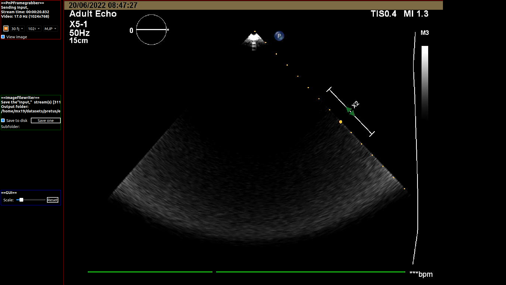

# 4 chamber detection for echocardiography
## Summary
This plug-in classifies input videos into 2 classes: Background or 4 chamber view. 
The model is implemented in Pytorch.

## Usage within PRETUS
* After building [plugin](../README.md), you can then run launcher help
```
cd $HOME/local/pretus
conda activate pretus
sh launcher_pretus.sh -h
```

* Terminal output for help
```
(8) Plugin Name: 'Four Chamber Detection'

# PLUGIN Four Chamber Detection
   Detection of four chamber view in echo clips.
	--fourchamberdetection_stream <val> [ type: STRING]	Name of the stream(s) that this plug-in takes as input. (Default: ) 
	--fourchamberdetection_layer <val> [ type: INT]	Number of the input layer to pass to the processing task. If negative, starts 
                                                		from te end. (Default: 0) 
	--fourchamberdetection_framerate <val> [ type: FLOAT]	Frame rate at which the plugin does the work. (Default: 20) 
	--fourchamberdetection_verbose <val> [ type: BOOL]	Whether to print debug information (1) or not (0). (Default: 0) 
	--fourchamberdetection_time <val> [ type: BOOL]	Whether to measure execution time (1) or not (0). (Default: 0) 
	--fourchamberdetection_showimage <val> [ type: INT]	Whether to display realtime image outputs in the central window (1) or not (0). 
                                                    		(Default: <1 for input plugins, 0 for the rest>) 
	--fourchamberdetection_showwidget <val> [ type: INT]	Whether to display widget with plugin information (1-4) or not (0). Location is 
                                                     		1- top left, 2- top right, 3-bottom left, 4-bottom right. (Default: visible, 
                                                     		default location depends on widget.) 
   Plugin-specific arguments:
	--fourchamberdetection_modelname <*.h5> [ type: STRING]	Model file name (without folder). (Default: models/model_001) 
	--fourchamberdetection_nframes <val> [ type: INT]	Number of frames in the buffer. (Default: 5) 
	--fourchamberdetection_cropbounds xmin:ymin:width:height [ type: STRING]	set of four colon-delimited numbers with the pixels to define the crop bounds 
                                                                         		(Default: 480:120:1130:810) 
	--fourchamberdetection_abscropbounds 0/1 [ type: BOOL]	whether the crop bounds are provided in relative values (0 - in %) or absolute 
                                                       		(1 -in pixels) (Default: 1) 
	--fourchamberdetection_showassistant 0/1 [ type: BOOL]	whether to show the AI assistant (1) or not (0) (Default: 1) 
	--fourchamberdetection_output <filename> [ type: STRING]	path to the output filename where results will be written (Default: output.txt) 

```


## Launching plug-ins
* Using `pnpframegrabber` with and without `pythonalgorithm`, `cppalgorithm`
```
sh launcher_pretus.sh -pipeline "pnpframegrabber>gui" --pnpframegrabber_camid 2
sh launcher_pretus.sh -pipeline "pnpframegrabber>pythonalgorithm>cppalgorithm>gui" --pnpframegrabber_camid 2
```

* Recording data
```
sh launcher_pretus.sh -pipeline "pnpframegrabber>imagefilewriter>gui" --pnpframegrabber_camid 2 --imagefilewriter_folder $HOME/datasets/pretus/echocardiography/ --imagefilewriter_framerate 30 --imagefilewriter_maxfiles 600 --imagefilewriter_verbose 0
```


* Using `fourchamberdetection` 
```
sh launcher_pretus.sh -pipeline "pnpframegrabber>fourchamberdetection>gui" --pnpframegrabber_camid 2 --fourchamberdetection_verbose 1
```

* Using video loop  
```
sh launcher_pretus.sh -pipeline "videomanager>fourchamberdetection>gui" --videomanager_input ~/data/VITAL/echo/01NVb-003-004-1lus.mp4 --videomanager_loop 1 --fourchamberdetection_nframes 5
```

## Animated GUI
Plugging launchs a GUI as shown below:

