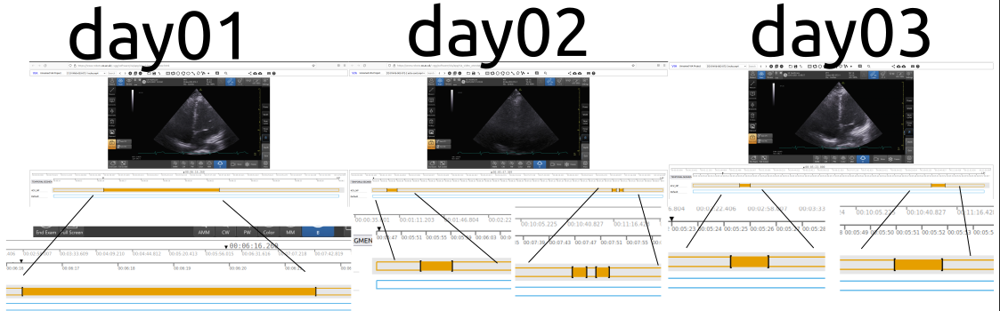

# Annotations for Four Chamber View (4CV) and Ejection Fraction (EF) in json files    
This path contains `json` files of different participants for annotations of Four Chamber View (4CV) and Ejection Fraction (EF). 
Templates are also available for the creation of new annotations.

## 1. Four Chamber View (4CV) [:books:](4CV)

### Instructions for User
Create a new directory when adding a new participant using the [template](01NVb_003_000_template).
To be sure all changes can be tracked, please add json files and be sure to add a commit message using `#IssueNumer annotation type, initials of Name and Surname of the annorator and short description of the commit` 

### Example: Participant Number 
The following is an example of the content of one participant.

#### Log
* [insert-date-time]: Name LastName and short description 
* e.g. [12Oct2021_11h58m00s]: Nhat Phung verified json files for each day.

#### Timeline figure  
* e.g.: 


#### Metadata in json files
To see metadata of json files, please open them in your web-browser.
Example: 
* 01NVb_003_072/01NVb_003_072_T1_4CV.json
```
metadata	
1_BXLfdQfa	
vid	"1"
flg	0
z	
0	376.279
1	381.54942
xy	[]
av	
1	"4CV_NP"
``` 

## 2. Ejection Fraction (EF) [:books:](EF)
TODO 
* [ ] add protocol on how to do annotations
 
